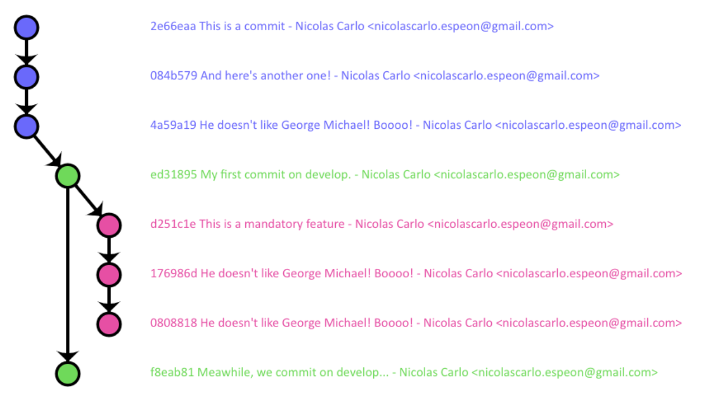

## The problem

Few time ago I was writing a post about [git workflows](/en/2013/08/which-git-workflow-for-my-project). I wish I could use some illustration to explicit my thoughts at this time.

The git-flow already provided a nice illustration of the big picture for this workflow. But the GitHub flow didn't.

Hopefully, [@nvie](https://twitter.com/nvie) gave [its Keynote source](http://github.com/downloads/nvie/gitflow/Git-branching-model-src.key.zip) and, hopefully, I've got Keynote. Therefore I designed the second illustration myself, exported it and then get an image to insert in my post.

It was not a difficult operation, as long as you get the correct tools. But this is frustrating:

* what if I want to do a little update?
* what if I want to change the whole design?
* what if I want to add some interaction?
* what if I want to learn saxophone?

## The solution

I wish I could find a nice little JavaScript library to design on-the-go graphs to illustrate my git worflows.

But, as we didn't find anything convincing enough, [@fabien0102](https://twitter.com/fabien0102) and I decided to develop our own solution : **GitGraph.js** !

Our guidelines are the following :

* simple and intuitive API
* flexibility and robustness of the result output
* customisable design

The project reached a convincing state, stable enough to meet our first requirements. And so we released `v1.0.0` and we'll scrupulously follow [Semver](http://semver.org/), promise!.

### Installation

Different solutions are available:

* you can either download [one of the latest releases](https://github.com/nicoespeon/gitgraph.js/releases) sur GitHub
* you can either use [Bower](http://bower.io) with `bower install gitgraph.js`

### Setting up

The set up process is dead easy.

Start adding the JavaScript (preferably before `</body>`) :

```html
<script type="text/javascript" src="js/gitgraph.min.js"></script>
```

Then add the CSS (preferably before `</head>`) :

```html
<link rel="stylesheet" type="text/css" href="css/gitgraph.css" />
```

Then, prepare some `<canvas>`, identified for **GitGraph.js** use :

```html
<!-- some HTML here (…) -->
<canvas id="another-graph-here"></canvas>
```

Here we go!

### Usage - Some examples

Using the library is straightforward : you just need to create a new GitGraph for each canvas, then to draw the desired graph.

Some parameters are customisable when you create your graph:

* the desired template: `"blackarrow"` or `"metro"` (default)
* the graph orientation: `"vertical-reverse"`, `"horizontal"`, `"horizontal-reverse"` or even `"vertical"` (default)
* the display mode: `"compact"` to hide commit messages, or `"extended"` (default, only with a `"vertical"` display for now)
* the targetted canvas ID (`"gitGraph"` is the default)
* A default author for commits messages

And so we create our very first graph this way:

```js
var myGitGraph = new GitGraph({
  elementId: 'my-canvas',
})
```

Then we add some branches:

```js
var master = myGitGraph.branch('master')
```

A bunch of commits:

```js
myGitGraph
  .commit()
  .commit()
  .commit() // 3 commits upon HEAD
```

Let's create a new branch and add few commits:

```js
var develop = myGitGraph.branch('develop')
develop.commit() // This commit will be on `develop`
```

Let's do whatever we want:

```js
// A new `feature` branch from `develop`
var myFeature = develop.branch('myFeature')

// A custom commit
myFeature.commit({
  dotColor: 'white',
  dotSize: 10,
  dotStrokeWidth: 10,
  sha1: '666',
  message: 'Pimp dat commit',
  author: 'Jacky <mailto:prince@dutunning.com>',
})

// Merge our feature branch back into `develop`
myFeature.merge(develop, 'Epic merge commit')

// Well we don't want to use it again, let's delete the old feature branch now
myFeature.delete()
```

The idea is to **adapt the library to your needs** so it could be intuitive.

There is still a lot of features to implement and bugs to correct. Please give us some feedbacks if you try it, that would be awesome =)

### Usage - The result

Here are some basic use cases that could already be answered with the library.

This JavaScript:

```js
var blackarrowSolution = new GitGraph({
  elementId: 'blackarrow-solution',
  orientation: 'vertical',
  template: 'blackarrow',
  author: 'Nicolas Carlo <mailto:nicolascarlo.espeon@gmail.com>',
})

var master = blackarrowSolution.branch('master')
blackarrowSolution
  .commit('This is a commit')
  .commit("And here's another one!")
  .commit()

var develop = master.branch('develop')
develop.commit('My first commit on develop.')

var feature = develop.branch('feature')
feature
  .commit('This is a mandatory feature')
  .commit()
  .commit()
develop.commit('Meawhile, we commit on develop…')
feature.merge(develop, 'Merged into develop')
feature.delete()

develop.commit('Add some commit here…').commit()
develop.merge(master, 'Here we merge!')
master.commit().commit()
```

Will produce the following output:



While this code:

```js
var metroSolution = new GitGraph({
  elementId: 'metro-solution',
  orientation: 'horizontal',
})

var master = metroSolution.branch('master')
metroSolution
  .commit()
  .commit()
  .commit()

var develop = master.branch('develop')
develop.commit().commit()

develop.merge(master, 'Here we merge!')
master.commit().commit()
```

Will output this graph:


## The project

Our project is open-source, available on GitHub : <a href="https://github.com/nicoespeon/gitgraph.js">https://github.com/nicoespeon/gitgraph.js</a>

Feel free to [add an issue](https://github.com/nicoespeon/gitgraph.js/issues/new) for any remark / suggestion / correction you'd have to do, or even to contribute more deeply. [A technical documentation for the source code](http://gitgraphjs.com/docs/) is available. A much more functional one is already considered, with concrete examples and use cases.

The project use the MIT license, <a href="http://choosealicense.com/licenses/mit/">which is simple and permissive</a>.

Have a look to the website for more information about the library: <a href="http://gitgraphjs.com">gitgraphjs.com</a>.

## Hey, what about the sax?

I was afraid you wouldn't ask. Thereupon I leave you with some Georges Michael tune \o/

<iframe width="560" height="315" src="https://www.youtube.com/embed/GaoLU6zKaws?rel=0" frameborder="0" allowfullscreen="true">&nbsp;</iframe>
