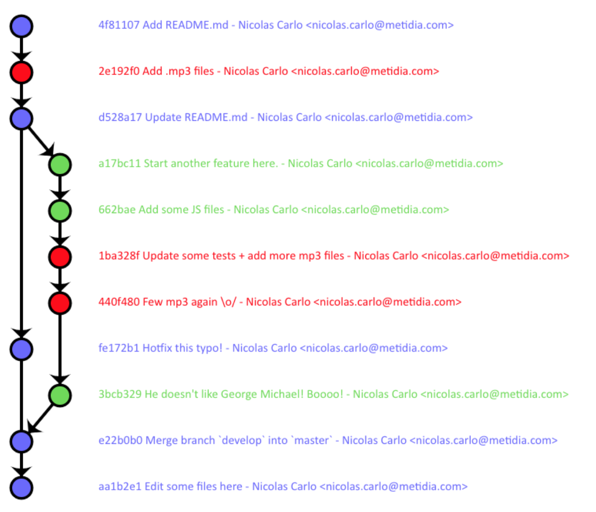
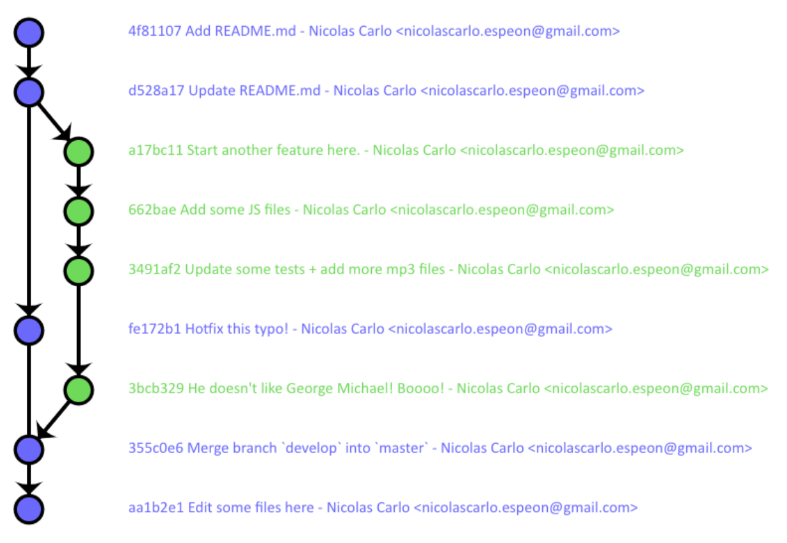

## The context

The life of a git repo could last and change a lot. Conventions often move with our knowledge and mastering of that stuff.

And there comes the day where you look at your project and realize that it wasn't such a good idea to commit those _external libraries / compiled outputs / videos and other media / &lt;your error here&gt;_.

I personally did a bunch of mistakes with git:

* one day I realized a bit late that if you commit a lot of audio files in your project, then you'll make it grow insanely. 5 minutes to perform a simple `git clone` is waaaaaay toooo looooooong.
* few time ago, I even managed to commit the whole `vendor/` folder of a project by mistake. It didn't play well with the nice GitHub stats of the project. That's a tough job to follow the activity of the team when there is a 20.000 updates peak on the very first week.

And then you realize that:

* it's pointless to revert the faulty commit(s), it won't remove the indexed modifications from the history
* the project may not be young, it'd be sad to rebase and re-write every commits from the last 3 months and loose information such as the author / the date
* and even sometimes you'll have your faulty files committed with other fixes and killer-features

Need another use case? Just think about Bernard who committed confidential information in a environment config file which should never have been versioned -have you heard about a guy called Murphy?.

Now you can figure out that situation when you open the Internet, searching for the magic git command. Here you go, this is precisely what's this post about -at least, the magic command I know.

## Magic happens here

Let's say I would like to **remove every MP3 files committed by mistake** from a whole project. Plus, **I don't want to change the author of each commit, neither the date** - but still I want to remove all trace from those files in the history to reduce the size of my repo.

To do so, I mystically wave my hand in the air and write the following incantation with the other:

```
git filter-branch -f --tree-filter "rm -rf \*.mp3" --prune-empty -- --all
```

Which would transform this history:



Into this clean and shiny one:



Dates and authors are still there, which wouldn't have been true with a classic rebase. Still, the history **has been rewritten**: SHA1 of commits which have been rewritten are different.

## It's a kind of magic

Let's see what is this looooong mystical command about.

### `git filter-branch`

The `filter-branch` command will rewrite a large number of commit in a scriptable way. In other words, it will rewrite the history regarding the options you give.

### `-f`

The `-f` option forces `git filter-branch` to start even if there is an existing temporary `refs/original/` directory already. Git will use this directory to perform some backup before going further.

It's not mandatory then, but if the backup can't be created, git will tell you to use it anyway.

### `--tree-filter "<shell command>"`

This option will check every commit of your tree and execute the given shell command.

I previously used `rm -rf *.mp3` to ensure there will not be any MP3 file surviving this operation. In this case, I needed to ensure the command is forced -this is for the `-rf` part- so the cleaning won't stop if there is an error because of _no-mp3-file-in-this-commit_ reason.

<strong>Note</strong> - In case you don't want to actually delete these files but just remove them from the git history, prefer to perform a <code>--index-filter "git rm -rf --cached --ignore-unmatch \*.mp3"</code> instead.

### `--prune-empty`

We prune any commit that would eventually be empty after we cleaned the history.

### `-- --all`

The first `--` will ensure we don't consider `--all` as a parameter for `--prune-empty`, but as another option. And so git will consider every branches of the history to perform the cleaning here.

## Final words

If you're many to work on the project, please remember that **rewrite the history is not a genuine action**, whatever the method you use. Then, if you really need to do that kind of manipulation, it will be easier for you colleagues to simply clone the new shiny repo.

If you fear that your manipulation won't work as expected, just clone the repo somewhere else before doing your stuff. So you'd be able to get it back in case something is going wrong.

<strong>Note</strong> - A good idea is to perform that kind of operations in another branch. If you're satisfied with the result, just reset hard the `master` branch onto this one and you're all set.

Here you go. I hope that could help you… but that you won't need to use it too often!
