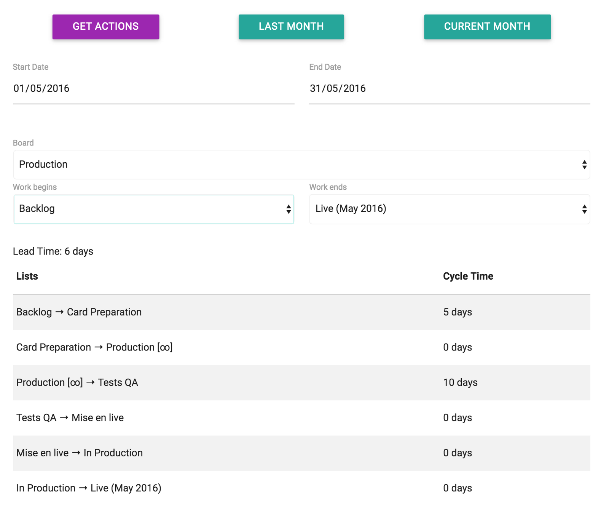

<figure>
  <blockquote>
    
<a href="http://nicoespeon.com/trello-kanban-analysis-tool/">nicoespeon.com/trello-kanban-analysis-tool</a>

  </blockquote>
</figure>

<figure>
  
  <figcaption>Drawing a CFD − Photo credits <a href="https://www.flickr.com/photos/visualpunch/">visualpun.ch</a></figcaption>
</figure>

## Trello ♡ Kanban

[Trello](https://trello.com/) is a powerful tool by its simplicity. Being user-centered, it’s easily adopted. It’s flexible enough to adopt a [Kanban](http://jpattonassociates.com/kanban_oversimplified/) flow.

Actually, [I do use Trello and Kanban a lot for Game Development](https://medium.com/@nicoespeon/kanban-and-game-development-with-trello-8819b33f83dc#.1y4ogdtui).

When you do Kanban, there are only a few metrics that you’re interested in. First, you probably want to draw the [Cumulative Flow Diagram (CFD)](http://brodzinski.com/2013/07/cumulative-flow-diagram.html). CFD is very easy to build and gives you great overview of what’s happening in the project. What you need to do is to count the number of tasks (cards) of each column (list), each day. Put this on a graph, connect dots, done:

<figure>
  
  <figcaption>CFD Cheet Sheet from <a href="http://leanguru.pro/the-cumulative-flow-chart-cfd-in-a-nutshell/">leanguru.pro</a></figcaption>
</figure>

It only takes 30 seconds everyday. But, **you have to do it everyday**. It’s not convenient to reverse engineer it if you missed some days.

Don’t get me wrong: this is not a difficult thing to do and you usually get the team involved in the process, so you are not likely to miss.

But, since you’re using Trello, you might expect to retrieve these information somehow with their API. That would mean not losing time doing this by hand. Also, it would be retroactive!

Among existing tools, [Ollert](http://ollertapp.com/) is great at providing Agile metrics from Trello boards, including CFD. Yet, if you’re just interested in Kanban metrics, that might not fit your needs. Plus, it doesn’t give you the second metric you’ll be looking for: [Cycle Times](http://leankit.com/learn/kanban/lean-flow-metrics/#lead-time-and-cycle-time) over a selected period.

## A great use case for a side-project

That unresolved need was a good opportunity for me to get out of my comfort zone and actually practice [Functional Reactive Programming (FRP)](https://gist.github.com/staltz/868e7e9bc2a7b8c1f754).

Thus, I decided to go with:

* ES2015 as this is a brand new JS project started in 2016
* [Cycle.js](http://cycle.js.org/), which is based on [Rx.js](https://github.com/Reactive-Extensions/RxJS), for the FRP approach
* [Tape](https://github.com/substack/tape) as a test runner — challenging out [Eric Elliott](https://medium.com/@_ericelliott) [advice](https://medium.com/javascript-scene/why-i-use-tape-instead-of-mocha-so-should-you-6aa105d8eaf4)
* [Brunch](http://brunch.io/) as an automation tool to ease my life with ES2015 stuff
* [Nvd3](http://nvd3.org/) to render graphs — that’s all about data visualization after all
* The [Trello API](https://developers.trello.com/)
* [Materialize](http://materializecss.com/about.html) to quickly set up a decent UI

Making Trello API and Nvd3 work with Cycle.js was quite a challenge. It makes me write my first Cycle.js drivers — which may end up into their own repositories once they will be standard enough to be used independently.

Developing with pure functions, composing them, thinking the application in terms of streams… that was really refreshing. I found that working with Cycle.js/Rx.js made me think differently. The approach is different.

<figure>
  <blockquote>
    
Leaving the app logic free from side effects allows to focus on a fraction of it without messing up something else.

  </blockquote>
</figure>

I found this simplifies working on small problems, building components that can be plugged to play together.

Future will tell me if that helps maintainability of a growing application.

## I finally got something that does the job

After some time working on it on my spare time, I finally reached the point of an app that does the basic job I needed. This is where I decided to open source what I’ve got so far — if it’s useful to me, it might be for someone else.

Naming things is hard. I went with _Trello Kanban Analysis Tool_, which I abbreviated TKAT. I’m not really good at naming things… well, at least it stands for what it is and the acronym is easy to catch 😀

So here it is: <https://github.com/nicoespeon/trello-kanban-analysis-tool>

I just spent some time to polish the README and set up few things to ease contributions.

So, here I am, introducing my ‘‘_JS library to analyse Kanban metrics from a Trello board’’_.

As a user of it, I already listed stuff I planned to improve, such as:

* Make it an web application, served by GitHub
* Skin it a bit, following Trello guidelines
* Deal with persistence so it would be more convenient for the user
* Deal with Trello API in a smarter way (e.g: not flooding the Trello API when a lot of data is missing for a selected period)
* Calculating throughput
* …

**If you are using Trello with Kanban workflow**, I’ll be glad you give it a try and [give me feedback](https://github.com/nicoespeon/trello-kanban-analysis-tool/issues/new) on what you think / is missing / isn’t working for you.

**If you are familiar with Cycle.js or Rx.js**, I’m all ears to suggestions. Please go check and criticize my implementation as I certainly not had everything right. Advices on good drivers implementation would be really valuable for example!

**If you don’t feel concerned about this** but still read the whole post… well that’s cool ¯\\\_(ツ)\_/¯

Thanks, take care and have fun!

<figure>
  
  <figcaption>At least, it does the trick.</figcaption>
</figure>
