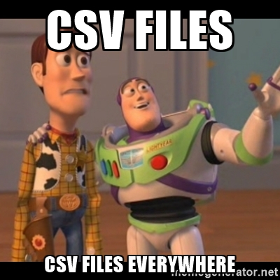
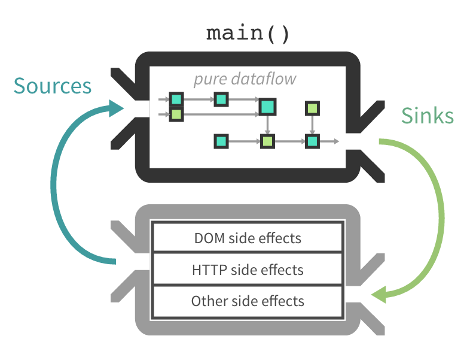
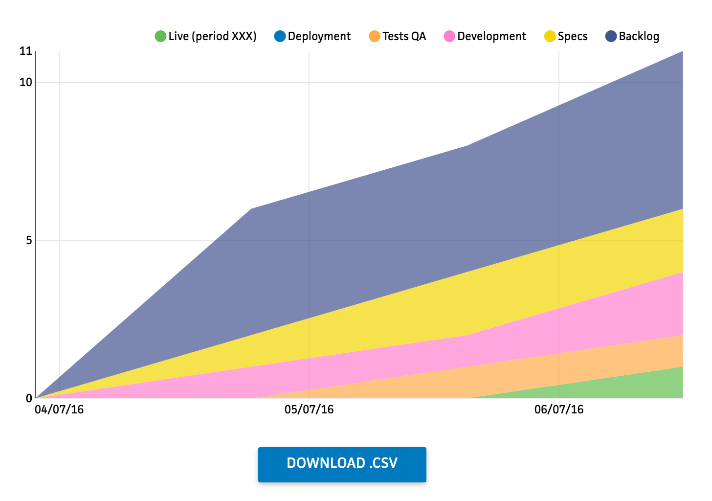

<figure>
  
  <figcaption>The art of merging streams  —  Photo credits <a href="https://www.flickr.com/photos/31246066@N04/">Ian Sane</a></figcaption>
</figure>

Programming with Cycle.js / Rx.js needs you to take another approach to the code. We have to switch your brain to think with a different paradigm − functional and reactive, instead of imperative and passive.

Unfortunately, there is a lack of concrete example, from concrete features, from real-life application.

Since I’m building [a tool to analyse Kanban metrics from a Trello board](https://medium.com/@nicoespeon/introducing-a-tool-to-analyse-kanban-workflow-on-trello-built-with-cycle-js-875ea0b35391#.wxa1atz0x) with Cycle.js, I do have concrete examples.

Here's one use case I want to share with you to illustrate how you deal with the user clicking a button to perform an action when everything is a stream.

## The feature

[Cumulative Flow Diagram (CFD)](http://brodzinski.com/2013/07/cumulative-flow-diagram.html) is a cool metric to help you understand what’s going on with our Kanban flow. In [TKAT](http://www.nicoespeon.com/trello-kanban-analysis-tool/), data are taken from the Trello API, consolidated then parsed to produce it.

However, this metric is contained in the entrails of the web app. This is not convenient if we want to re-use or share these information in any way (e.g., to build a global report for external stakeholders).

What if the data was parsed and we can download a `.csv`? That would be awesome.



## Building awesomeness, one stream at a time

From a user point of view, we would like to have a “_Download_” button somewhere close to the graph — probably just below. Clicking on this button will download the .csv of the current graph.

If we change the period/selected lists range and then click on the download button, it should keep matching the displayed graph. We should be able to draw that graph again after we import our data into Excel/GSheet.

In other words: each time a click on the button happens, download in CSV format the latest data.

Let’s interpret this in Cycle.js terms:

* _“each time …”_: subscribe to the following stream
* _“… a click on the button happens, …”_: `downloadClicks$`, a stream representing button clicks
* _“… download in CSV format …”_: a side-effect, performed by a dedicated `ExportToCSV` driver
* _“… the latest data.”_: `csvData$`, a stream representing data

There is already a stream containing CFD data since we display them already. We simply need to map them to produce a `csvData$` that matches the input format of `ExportToCSV` driver.

Then, we need to combine our streams to get the latest value from `csvData$`whenever — and only when — an item is emitted in `downloadClicks$`.

Brace yourself, there is a Rx.js operator for that: [withLatestFrom()](http://rxmarbles.com/#withLatestFrom).

This is what we want to achieve:

```text
downloadClicks$:  -------x------x----------------x---------->
       csvData$:  ---A---------------B----C--D-------E------>

                     withLatestFrom((clicks, data) => data)

  downloadData$:  -------A------A----------------D---------->
```

Combining our streams will produce another one (`downloadData$`) that will emit an item containing CSV-formatted data whenever a click happens on the button.

## What about the download?

Downloading a CSV file from formatted data, this looks like a job for a driver!

Indeed, this kind of operations implies side-effects since the program needs to output something that is visible to the user. This is the part where our application unleash its added value. This is also the part where nasty bugs might lie, regarding the environment, the global state of the machine, etc.

That’s why we prefer to move this part into a dedicated driver, away from our application logic.



Our app is pure dataflow while downloading a CSV file is part of side effects stuff.

_Note: I didn’t find an open-sourced “downloadToCsv” driver at the time of implementing the feature, so I build my own for this project. With a very little refactoring, it can easily be open-sourced though._

```js
import R from 'ramda'

// Export a driver to be used in our Cycle.js app.
// It takes an `input$` stream that contains `data` to be download.
function exportToCSVDriver(input$) {
  // `data` should be formatted as an Array of Arrays (= lines of CSV).
  // -> `[["name1", "city1", "other info"], ["name2", "city2", "more info"]]`
  input$.subscribe(data => {
    // Parse data to create a CSV file.
    // See: http://stackoverflow.com/questions/14964035/how-to-export-javascript-array-info-to-csv-on-client-side
    let csvContent = 'data:text/csv;charset=utf-8,'
    data.forEach((infoArray, index) => {
      const dataString = infoArray.join(',')
      csvContent += index < data.length ? `${dataString}\n` : dataString
    })

    // Create a link in the page to trigger the download.
    const link = document.createElement('a')
    link.setAttribute('href', encodeURI(csvContent))

    // Name the CSV file based on data attributes.
    // Implementation is based on TKAT specificities (https://github.com/nicoespeon/trello-kanban-analysis-tool).
    // This part can be refactor to open-source the driver.
    const head = R.head(data)
    link.setAttribute('download', `cfd-from-${head[1]}-to-${R.last(head)}.csv`)

    // Required for Firefox.
    document.body.appendChild(link)

    // Download the data file.
    link.click()
  })
}

export { exportToCSVDriver }
```

The driver subscribe to an observable (= stream) input.

Anytime it emits an event containing formatted data, it will perform the side-effect: download the CSV file from these data. Thus, we would simply pass our `downloadData$` stream and we’re done!



And here it is, our “Download .csv” button, waiting for users to click it!

[Here is the PR](https://github.com/nicoespeon/trello-kanban-analysis-tool/pull/25/files) that implemented the feature, in case you want to read the concrete diff.

What are your feelings about this approach? Would you have done it differently? I’d love to discuss about it!
