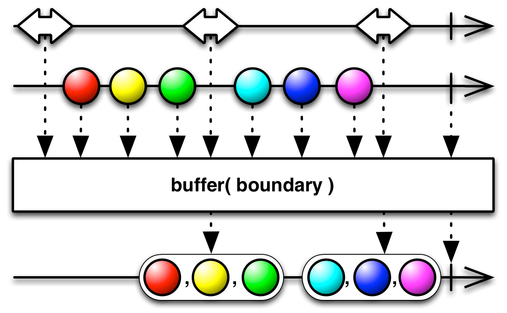
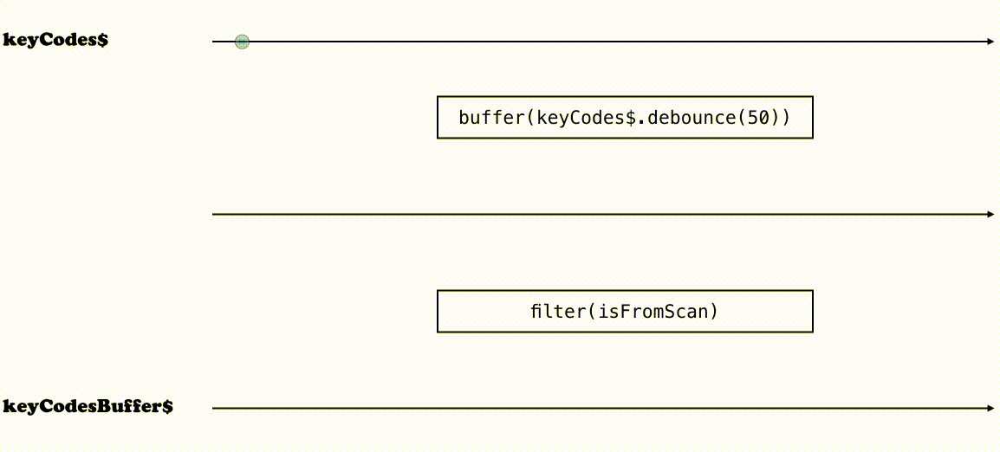

In this post, I’ll talk about a concrete use case in which Observables turn to be remarkably relevant to make our code cleaner and more maintainable.


## How to spot a barcode scanner?!

Yup! This is kind of a specific example. But it perfectly illustrates issues that would beg you for using Observables.

A barcode scanner simply emulates the keyboard. It reproduces the scanned code, emitting keypress signals, ending with the “Enter” key − which key code is _13_.

Let’s say we’re developing an app that allows users to search products from their 16-chars code reference. Rather than typing them by hand, users should be able to use a barcode scanner to trigger the search.

> “Just let the user focus the search input, scan and you’re done!”

Sure, it’s native behavior.

But the search feature is contained inside a popup that can be open with a button. And we’ve been told the app should be super-ergonomic! Whenever the user scans a barcode, we should open the popup and fill the input with the scanned code.

Now, the problem is: how do we differentiate a scanned code from other keypress events? Let’s say the user hit a key before scanning the code: we don’t want that key to be part of the scanned code!

## Solving this, the imperative way

We surely need to listen to keypress events… Then we must… remember the key codes, probably using a buffer! If the key pressed is the “Enter” key, fill the input and clean the buffer. Otherwise, add the key to the buffer!

Let’s try this first shot:

```js
const ENTER_KEY_CODE = 13
let keyCodesBuffer = []

document.addEventListener('keypress', event => {
  const keyCode = event.keyCode

  if (keyCode === ENTER_KEY_CODE) {
    fillInputWithKeyCodesBuffer()
    cleanBuffer()
  } else {
    addToBuffer(keyCode)
  }
})

function fillInputWithKeyCodesBuffer() {
  // …
}

function cleanBuffer() {
  keyCodesBuffer = []
}

function addToBuffer(keyCode) {
  keyCodesBuffer.push(keyCode)
}
```

Good.

But this is not enough: it doesn’t differentiate scanned codes from regular keypresses!

We know that, if no new keypress is emitted after ~50ms, it’s not a scanned code for sure and we can clean the buffer.

```js
const ENTER_KEY_CODE = 13
const MAX_INTERVAL_BETWEEN_EVENTS_IN_MS = 50
let keyCodesBuffer = []

document.addEventListener('keypress', event => {
  const keyCode = event.keyCode

  if (keyCode === ENTER_KEY_CODE) {
    fillInputWithKeyCodesBuffer()
    cleanBuffer()
  } else {
    addToBuffer(keyCode)
    cleanBufferAfter(MAX_INTERVAL_BETWEEN_EVENTS_IN_MS)
  }
})

function fillInputWithKeyCodesBuffer() {
  // …
}

function cleanBuffer() {
  keyCodesBuffer = []
}

function addToBuffer(keyCode) {
  keyCodesBuffer.push(keyCode)
}

function cleanBufferAfter(timeout) {
  setTimeout(cleanBuffer, timeout)
}
```

Hmmm… not bad. But there is a subtle bug here: if the code takes more than 50ms to be scanned, it will drop the beginning…

In fact, if a new keypress occurs within 50ms, we should clear the timeout.

```js
const ENTER_KEY_CODE = 13
const MAX_INTERVAL_BETWEEN_EVENTS_IN_MS = 50
let keyCodesBuffer = []
let cleanBufferTimeout

document.addEventListener('keypress', event => {
  const keyCode = event.keyCode

  stopCleanBufferTimeout()
  if (keyCode === ENTER_KEY_CODE) {
    fillInputWithKeyCodesBuffer()
    cleanBuffer()
  } else {
    addToBuffer(keyCode)
    cleanBufferAfter(MAX_INTERVAL_BETWEEN_EVENTS_IN_MS)
  }
})

function fillInputWithKeyCodesBuffer() {
  // …
}

function cleanBuffer() {
  keyCodesBuffer = []
}

function addToBuffer(keyCode) {
  keyCodesBuffer.push(keyCode)
}

function cleanBufferAfter(timeout) {
  cleanBufferTimeout = setTimeout(cleanBuffer, timeout)
}

function stopCleanBufferTimeout() {
  clearTimeout(cleanBufferTimeout)
}
```

Now we’ve got something working.

Let’s take a step back and think: what if we’ve had the full history of keypress events we could manipulate to filter out scanned codes sequences? Would the code be simpler? Let’s figure this out…

## Solving this, with Observables

For this kind of use cases, I find Observables to be a powerful abstraction to represent our data.

> Observables are **immutable collections of asynchronous events** you can manipulate through **operators**.

If we use things like `map` and `filter` over arrays, then we’re already familiar with that way of thinking.

> If Observables are still cryptic for you so far, I’d suggest you to read [this excellent introduction to Reactive Programming](https://gist.github.com/staltz/868e7e9bc2a7b8c1f754) from André Staltz.

So, instead of responding to each event individually, let’s collect all events into a single stream that we can transform.

```js
const keyCode$ = Rx.Observable.fromEvent(document, 'keypress')
  // ---(ev)--(ev)--------(ev)--->
  .pluck('keyCode')
// ---(43)--(51)--------(13)--->
```

The **$** sign at the end of the variable name means “Stream”. It’s a convention I use to know the variable I manipulate is an Observable in non-typed languages, just like I’d call **elements** an array of **element**, or **$header** the jQuery representation of the header.

Now we have a stream of key codes. Any time a keypress event occurs, a new event, which value is the corresponding key code, is emitted.

At the end of the process, we’d like to have a stream we can subscribe to. Each event of the stream should represent the scanned code. So we need to make batches of key codes in a way that isolates scanned codes from parasitic keypresses.

To do so, we can **buffer** our stream using a **debounce** strategy: when an event occurs, wait 50ms for another one. If another event is emitted within this time frame, wait another 50ms. If no other event occurs within this time frame, make a batch of the passed events.



This is what we want to achieve with [the buffer operator](http://reactivex.io/documentation/operators/buffer.html)

```js
const MAX_INTERVAL_BETWEEN_EVENTS_IN_MS = 50

const keyCode$ = Rx.Observable.fromEvent(document, 'keypress').pluck('keyCode')

const keyCodesBuffer$ = keyCode$
  // --(43)-(64)----(32)-----(65)-(77)-(13)--->
  .buffer(keyCode$.debounce(MAX_INTERVAL_BETWEEN_EVENTS_IN_MS))
// --([43,64])----([32])-----([65,77,13])--->
```

So far, so good!

Now, all we have to do is to filter out batches that don’t look like scanned codes. And we know that a scanned code is a sequence that ends with the “Enter” key.

```js
const ENTER_KEY_CODE = 13
const MAX_INTERVAL_BETWEEN_EVENTS_IN_MS = 50

const keyCode$ = Rx.Observable.fromEvent(document, 'keypress').pluck('keyCode')

const keyCodesBuffer$ = keyCode$
  .buffer(keyCode$.debounce(MAX_INTERVAL_BETWEEN_EVENTS_IN_MS))
  .filter(isFromScan)

function isFromScan(keyCodes) {
  return keyCodes.length > 1 && keyCodes[keyCodes.length - 1] === ENTER_KEY_CODE
}
```

Finally, let’s subscribe to this stream we have created and execute our callback each time a new event is emitted.

> Nothing will happen until we subscribe to the Observable, since they are lazy.

```js
const ENTER_KEY_CODE = 13
const MAX_INTERVAL_BETWEEN_EVENTS_IN_MS = 50

const keyCode$ = Rx.Observable.fromEvent(document, 'keypress').pluck('keyCode')

const keyCodesBuffer$ = keyCode$
  .buffer(keyCode$.debounce(MAX_INTERVAL_BETWEEN_EVENTS_IN_MS))
  .filter(isFromScan)

function isFromScan(keyCodes) {
  return keyCodes.length > 1 && keyCodes[keyCodes.length - 1] === ENTER_KEY_CODE
}

function fillInputWith(keyCodes) {
  // …
}

keyCodesBuffer$.subscribe(fillInputWith)
```

## What we did here

This is a visual illustration of what we did to go from `keyCode$` − which was created from keypress events − to `keyCodesBuffer$` we subscribed to:

<figure>
  
  <figcaption>Transforming the stream of key codes into a stream of scanned codes</figcaption>
</figure>

There are a few things to notice with our final code:

* we don’t have to manage things like timeout and buffer manually
* hence, code is shorter, **focused on the actual work**
* `fillInputWith()` doesn’t rely on a global buffer, which is more **testable** and **reusable** − actually, we are few small steps from making the whole logic purely functional
* we just manipulate *const*s, nothing is reassigned, which is **simpler to reason about**
* created Streams can be **reused** to do other things ; we can **add features without fear** of breaking this one
* we could easily fix issues in this code, injecting operators into streams creation pipes, if necessary − e.g. we’d probably filter out non-interesting key codes from `keyCode$` as simply as `.filter(isValidKeyCode)`

In my opinion, the one difficult thing is to reason with streams and understand how to solve our use case with given operators.

But, I believe this is something that just takes practice 😉
