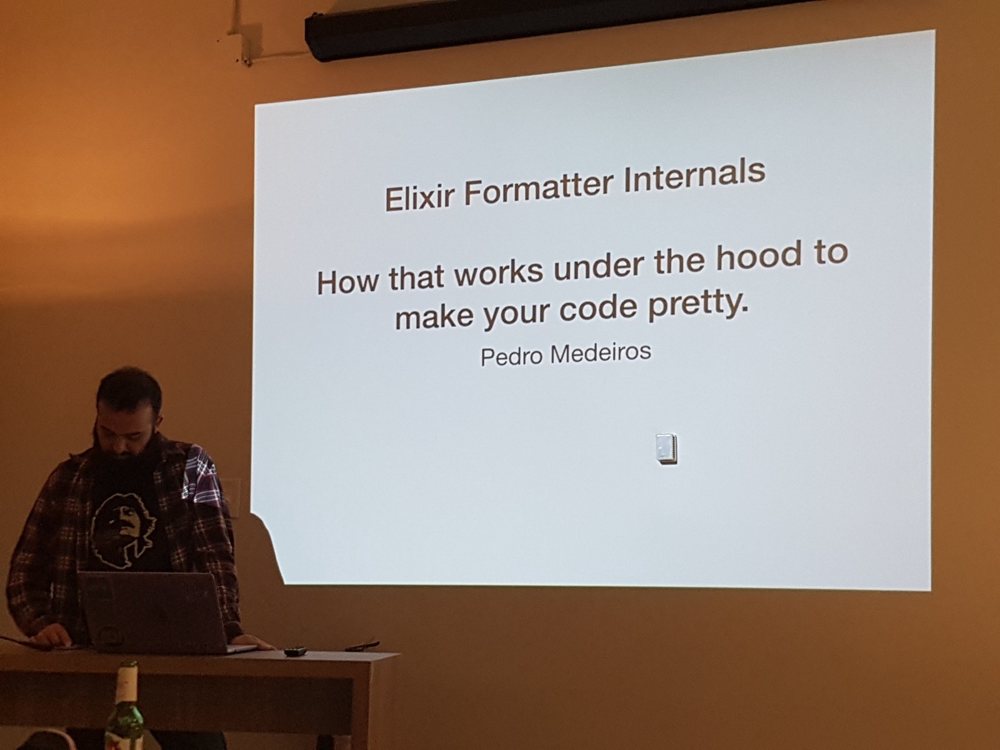

Few days ago, I went to [Montréal Elixir meetup of March](https://www.meetup.com/fr-FR/montrealelixir/events/247188552/).

I’m French. I moved to Montréal in February. Thus, this is the beginning of a new life for me ; a Canadian-dream as a Developer at Busbud. I used to attend / talk at / organize a lot of meetups, back in Paris. I’m now looking to meet the tech community of Montréal.

So here is my feedback about how this meetup was, and what you could expect from it.

By the way, if you don’t know it yet: [Elixir is a dynamic, functional language](https://elixir-lang.org/).

It is built upon Erlang shoulders, which is really fault-tolerant and built for scalability (think telecoms). To put them in a nutshell, I’d say Elixir main goals are: productivity, maintainability and reliability.

[Montréal Elixir](https://www.meetup.com/fr-FR/montrealelixir/) is a monthly meetup. The community is not big − we were around 20 persons at the event.

They do have a website: [http://www.montrealelixir.ca](http://www.montrealelixir.ca/)

The typical agenda of the meetup is:

* **Networking & food** first, which is a nice ice-breaker.
* **Announcements** from Elixir community, about books, news from the meetup organizers…
* **Talks**, usually 20 minutes ones. But we’ll try some lightning talks (5min) in the future.
* **Sponsor talks & open mic** to anyone who’d have something to share to the group

It starts at 18:30, ends at 20:00, which is great if you want to go back home early. People generally speak english there, so it’s more inclusive.

This meetup talk was from [Pedro Medeiros](https://twitter.com/pesnk) on **“Elixir formatter internals”**.

In case you wonder, a formatter is a tool that aims to maintain a consistent style for your project. Thus, you don’t loose time discussing whether there must be a space before your parenthesis, nor you waste time with the linter telling you that you forgot a trailing space somewhere.

If you are familiar with JavaScript rather than Elixir, this is [Prettier](https://prettier.io/) goal. Handles the syntax for you so you don’t have to bother. If you do Elm, this is [elm-format](https://github.com/avh4/elm-format) job.

So it really helps **productivity**.

Elixir formatter is built-in. You can run it with `mix format`.

The talk focused on how the formatter works to format your code − building an AST, then logically applying the standard rules to re-write your code with proper indentation/spaces…

The meetup was nice and I enjoyed the community. I met and discussed with [Henry Olders](http://henry.olders.ca/wordpress/), who is both a psychiatrist and engineer. We discussed machine learning, Elixir and scalability.

😃👍 I really enjoyed that time and will come back to next sessions. Join us!

---

To conclude, here are some books recommendation I get from the meetup:

* 📕 [Functional Web Development with Elixir, OTP, and Phoenix](https://pragprog.com/book/lhelph/functional-web-development-with-elixir-otp-and-phoenix)
* 📘 [Learn Functional Programming with Elixir](https://pragprog.com/book/cdc-elixir/learn-functional-programming-with-elixir) (good for beginners and newcomers to Functional Programming)
* 📄 [To spawn or not to spawn](http://theerlangelist.com/article/spawn_or_not) to understand how to _think_ in terms of processes, from the author of [Elixir in action](https://www.manning.com/books/elixir-in-action-second-edition)
