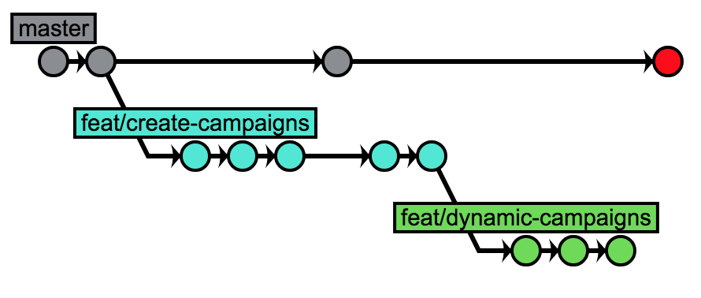
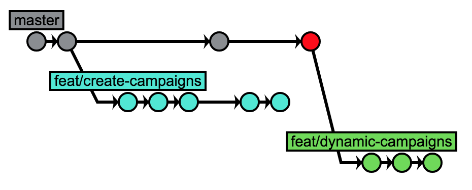
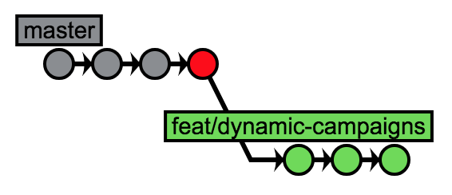

Thursday.

Sprint M started this Monday, just after the usual round of applause that ends every daily standup. When you looked at the backlog, you found it a bit ambitious, too optimistic, greedy. A new mountain the team started to tear apart methodically, piece by piece, progressively stacking these pieces under the “Done” column. The mountain was now bleeding through each column of the flow. Each story shows the head of the person − usually a developer − currently working on it. The whole thing is a chain, stories flowing from left to right, carried by the members of the team…

> Just like ants carry food to the anthill.

You’d like to think about the metaphor a bit longer, but Ahmed brings you back to reality: “About the code review you asked me: is it OK if I do it at 3? I don’t really have time before…”

You frown:

“Well, why not but it’s inconvenient for me. The new feature I need to work on depends on these changes so… I’m blocked now.”

“I get that, but I really can’t do that sooner. And I wouldn’t like to scamp it neither.”

“OK, go for 3pm!”

“Anyway, you are not blocked. Just start from the current branch. You’ll rebase later.”

“How’s that?”

“Well, just start from the current branch. You create a new branch from this one and you work on it.”

“Thanks but… no. Look, if I do that, the PR diff will contain changes from both branches. It’ll be a mess!”

“Trust me. Create a new branch, work on it and we’ll figure this out later together.”

“If you say so… Thanks.”

You turn back to your screen while Ahmed heads rapidly toward the meeting room with his laptop. You still hesitate.

> Damn it. Let’s do that.

<figure>
  
  <figcaption>Creating `feat/dynamic-campaigns` branch</figcaption>
</figure>

---

15:30. You get the notification telling your PR has been approved. Satisfaction makes you smile. In the same time, Ahmed rolls his chair to your desk.

“Legit to me. Nice job on this feature, nothing I could think of. Neat!”

“It was a small PR. It helps.”

“Sure. Anyway, you can merge it now.”

“Yup. I was just doing it aaaaaaaand… Done!”

“Great!”

As he’s about to roll in the opposite direction, you add:

“Wait a minute. I created a branch like you told me. I did a few commits on it. But now it’s starting from the other branch, the one I merged.”

“Not a problem. You need to rebase it on `master`.”

“And how am I supposed to do that?”

“It’s not a big deal. Let’s see. First, show me you git log.”

“There you go!”

<figure>
  
  <figcaption>Git history, `feat/dynamic-campaigns` starting from `feat/create-campaigns`</figcaption>
</figure>

“See the last commit on `master`? This is the branch you merged. We use the “squash and merge” strategy, so your feature became a single commit on `master`.”

“I never get that part. Like, why are we doing that anyway?”

“This is another debate. In short, some prefers the fact that “1 commit = 1 feature”. Technically, because our branches are quite short-lived, it works. Thus, `master` is always stable.”

“Yeah… But I’ve read that it’s better to keep the actual history.”

“Maybe. Anyway, this is our convention for now. If you want to change it, go ahead and propose the subject during tomorrow’s tech meeting.”

“OK.”

“Back to what you want to do. You want to take the green branch `feat/dynamic-campaigns` and move it so it starts from `master`.”

“Hmmmm… yeah, that’s it.”

“To do that, you need to use `git rebase`. There is an option called “onto” which does exactly that.”

“Like rebase onto `master`?”

“Kind of. Look.”

<figure>
  
  <figcaption>Rebasing the branch from old parent onto master</figcaption>
</figure>

Still a bit puzzled, you’re trying to figure out what just happen:

“Wait a minute. Can you explain?”

“Sure. You see, `git rebase` can have a parameter called “onto” which is useful in such scenarios. It takes 3 arguments.”

“So the first one is `master`. That’s the new branch, right?”

“Right! It’s the reference of the new parent for the what you’re rebasing. Then comes the reference of the old parent: `feat/create-campaigns` in this case.”

“But… Didn’t we merge this one before?”

“On origin yes. Locally on your computer, no. Remember your git history? You still have that branch on your machine.”

“OK, got it. So new parent, then old parent…”

“Then the reference of the branch you want to rebase. Technically, any commit reference will do. But usually, you work with branches.”

“It’s more convenient.”

“Yeah. The last argument is optional. If you don’t provide it, it’ll use HEAD as a reference. But, you know me, I like when things are explicit. Less surprises.”

You nod while displaying the new git history to visualize what you’ve done:

<figure>
  
  <figcaption>Git history after rebasing the branch</figcaption>
</figure>

“Hey, it worked! It’s just like the branch started from `master`!”

“That’s what you asked for.”

“Thanks a lot! I’m gonna write this done somewhere.”

“My pleasure.”

On this final line, Ahmed pushes on his feet to roll back to his desk in a single attempt. Failed. As he tramples to finish rolling, you clean the local branch that has no more reason to be.

> Bye.

<figure>
  
  <figcaption>Deleting `feat/create-campaigns` branch</figcaption>
</figure>

You smile and give another look at the git history.

<figure>
  
  <figcaption>Final git history</figcaption>
</figure>

Clean.

You look at your watch. 15:45. You open your editor thinking that you still have time to work a bit more on this.

> Another story processed. Just like ants…
