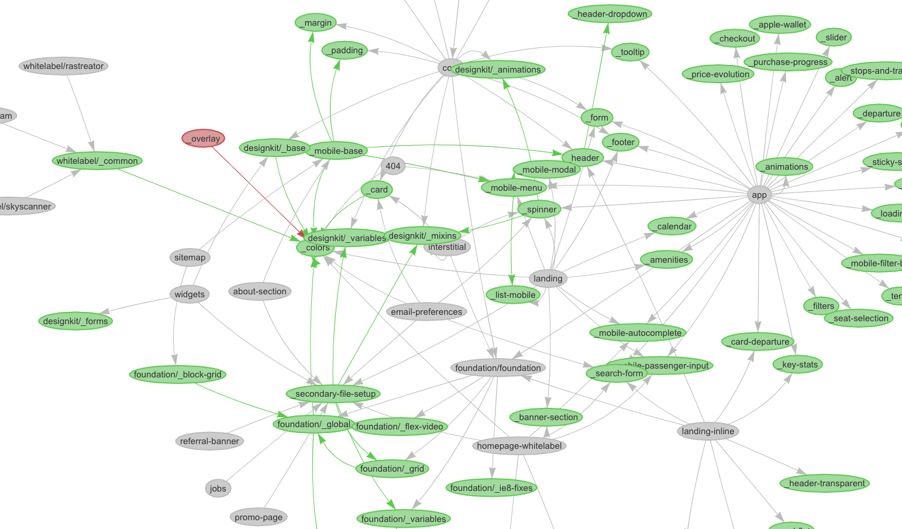

I currently work as a web developer at Busbud.

Part of our stack is the public website that you can see at [https://www.busbud.com](https://www.busbud.com/). The first commit of its source code was made on January 2011. Today is December 12th, 2018. It has been almost 8 years!

For 8 years, the codebase has been growing. Today, code is still constantly updated to add new features, adopt or remove experiments, fix bugs… As we work, we need to deal with existing, working, legacy code and ensure nothing breaks when we change it.

Today, I’d like to tell you about the styles part.

## A lot of Sass files…

A choice has been made, long time ago, to use [Sass](https://sass-lang.com/) as a pre-processor for our stylesheets.

This is great. It simplifies maintenance of styles thanks to variables, mixins and other niceties Sass brings to us.

Among the niceties, we do use `@import` a lot. It allows us to import partial files into others and compile them into a single CSS stylesheet. Again: this is great. It allows us to split styles into smaller chunks (convenient for development) and get a single stylesheet in the end (convenient for production).

But `@import` creates dependency relationships between Sass files. Today, we face issues of dependency graph management in a growing codebase. Now, I'm not talking about critical problems like circular dependencies − Sass does a great job dealing with that. I'm talking about understanding the dependency graph as a whole. It usually boils down to these questions:

* In which final CSS will this style be compiled to?
* Will this style be compiled into a CSS file where it’s not needed?
* Is there any file not imported anymore?
* Is there any (useless) duplicated import of the same partial?

These are tricky questions to answer when you have a lot of files.

The dependency graph of our codebase is not trivial. It started with a bunch of Sass files along Jade templates ; now we miss a clear architecture to maintain our styles with ease. Hopefully, we’ve identified this technical debt, and we’re taking actions to pay it back.

But, until then, we have to work with this complicated Sass codebase.

Now, to visualise what we’re working with, I realised we need a tool to turn on the light.

## Turn on the light, please

I first went to [sass-graph](https://www.npmjs.com/package/sass-graph). It’s a library which computes the dependency graph of a Sass codebase. Unfortunately, it was only able to output some sort of graph in my terminal, or a JSON structure. But to answer rapidly previous questions, I needed something **visual**.

Thus, I decided to _plug_ sass-graph with a rendering library:

<figure>
  <blockquote>
    <p><a href="https://github.com/nicoespeon/sass-graph-viz">sass-graph-viz</a></p>
    <footer>
      <cite>Draw a visual graph of Sass dependencies</cite>
    </footer>
  </blockquote>
</figure>

The difference is that sass-graph-viz generates a visual graph of dependencies in the browser.

You can use it as a CLI tool, as illustrated in this gif (a demo of v1):


You can quickly try it out with npx: `npx sass-graph-viz path/to/your/scss`

Or, you can install it with npm: `npm i -g sass-graph-viz`

Then use it in your terminal:

```
$ sassgraphviz --help
  Usage: sassgraphviz [options] <target>

  Options:
    -e, --exclude-externals  Omit files that are not under given target
    -s, --simple             Generate a simpler visualization (not recommended for complex graphs)
    -p, --port <port>        Port to use [3000]
    -h, --help               Output usage information

  Examples:
    sassgraphviz assets/scss
    sassgraphviz .
    sassgraphviz main.scss
    sassgraphviz main.scss -s -e -p 3001
```

Alternatively, you can use the alias `sgv` if `sassgraphviz` is too cumbersome to type.

## How is this built?

It’s merely a plug of something that generates the dependency graph (sass-graph) and a graph rendering library. It exposes a CLI for convenient usage, and uses the browser to render the graph.

For graph rendering, I first went for [viz.js](https://github.com/mdaines/viz.js) because the API was simple and the result looked great.

The core idea of sass-graph-viz is:

1. Expose a CLI command to get the path to the directory I want to parse
2. Delegates to sass-graph the generation of dependencies graph
3. Translate sass-graph’s Graph into my own `Graph` model
4. Delegates to viz.js the rendering of the `Graph` in the browser


Now you might wonder: what’s the point in parsing sass-graph outputs into another `Graph` model?

I’d say this is the heart of the lib. This is my domain. Now, it’s probably really thin and might feel _useless_, but I have a few arguments in favor of this choice:

1. The rendering lib doesn’t need all of the details sass-graph generates in its “Graph” modelling.
2. The “Graph” from sass-graph doesn’t quite fit the rendering lib expected format anyway. A parsing is necessary at some point.
3. Maybe I’ll swap sass-graph for another tool, if I found a better one. If so, I’d better not tie the rendering lib to sass-graph implementation.
4. I don’t know yet all the features I’ll need to implement with the rendered graph. I don’t want to be limited by sass-graph capacity.

I quickly got it working for simple structures with viz.js. It helped me set up the architecture of the solution, exposing a CLI command to generate the graph.

For example, running `sass-graph-viz assets/scss/` would produce following result:


## But my graphs are more complex than that!

Otherwise, I wouldn’t have needed this tool anyway.

I moved to more realistic examples, running the tool against the codebase I was working on. There I confirmed I needed a better rendering lib to handle complex graphs.

I found [vis.js](http://visjs.org/) − yeah, the one-letter difference is subtle. The lib showcases very cool, interactive graphs and the API looked nice. It was the solution I was looking for!

As the graph generation, the domain and the rendering were independent, is was really just about plugging another rendering adapter. One that would do the rendering with vis.js.

I enhanced the CLI a bit so vis.js became the default rendering lib and viz.js would be opt-in (with the `-s, --simple` option). I also provided a shorthand alias, so I wouldn’t need to type `sassgraphviz` every time.

At that point, running `sgv assets/scss/` on previous example would produce following graph:


Few things to say here:

* Unlike previous graph, this one is interactive. You can zoom, select and move nodes, as showcased in demo gif.
* We visually distinct regular Sass files (e.g. `main.scss`) from partials (e.g. `_header.scss`). Partials are meant to be imported. I thought the distinction would be interesting.

And here’s where the separation of the domain started to pay off: I realised that I could add features to my graph, so it would be more useful. Identifying partial files is not the role of sass-graph, nor the one of the rendering lib. This belongs to the domain I created here. That also means it can be unit tested really easily: no need to manipulate actual Sass files, nor to spy on the browser.

## Features, I want moar!

From usage, I noticed few quirks that I fixed. I also identified (and implemented) useful features.

The first one is the ability to exclude “external files” from the rendered graph. By “external files” I mean files that are outside the scope of the target folder. For example, we do import some source files from Bootstrap package which lives in `node_modules/` − which is probably not the best idea, but these things happen. As I certainly can't change all of these Bootstrap Sass files, I'd prefer they don't show up and clutter my graph. I want to think about what I _can_ change.

So here it is: `sgv -e assets/scss/` will omit these external nodes from the generated graph.

Another feature from sass-graph-viz is the ability to focus on a file only. It’s very handy to only see a subset of the Sass files, the ones that are linked to a specific file. Intuitively, `sgv assets/scss/core.scss` does the trick and focus on `core.scss` dependencies (parents and children) only.

The last feature I wanted to highlight is the guidance the tool can provide. After all, since it computes the dependency graph of my Sass files, it could certainly detect suspicious patterns. One I identified was “the orphan partial” pattern. An “orphan partial” is a partial file that doesn’t have a parent. Which is weird, as partials are meant to be imported. These are likely dead code we can remove. And it paid off: I was able to detect some of them in our codebase, and get rid of these unused files!

Typically, the tool would render suspicious nodes in red, like so:


## This was fun

I had a great time building this little tool. So far, it was useful to understand the relationship between all of these Sass files. It might become useless when we’ll solve the root cause of this mess, but it’s a handy tool to work with a complicated Sass codebase.

I hope it might be useful to you, if you face such situation. If you do, let me know about it!

If you have any comment, I’ll be happy to reply here or directly on [GitHub issues](https://github.com/nicoespeon/sass-graph-viz/issues).

PS: If you’re into [Hexagonal Architecture](http://fideloper.com/hexagonal-architecture), what I described may sounds like ports & adapters. It is. Just, I didn’t made interfaces & the hexagon explicit yet (functions and types were simple enough to do so).
