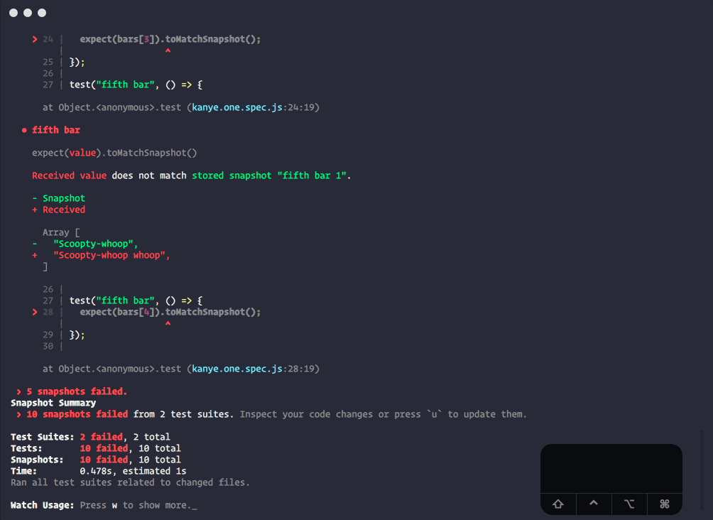
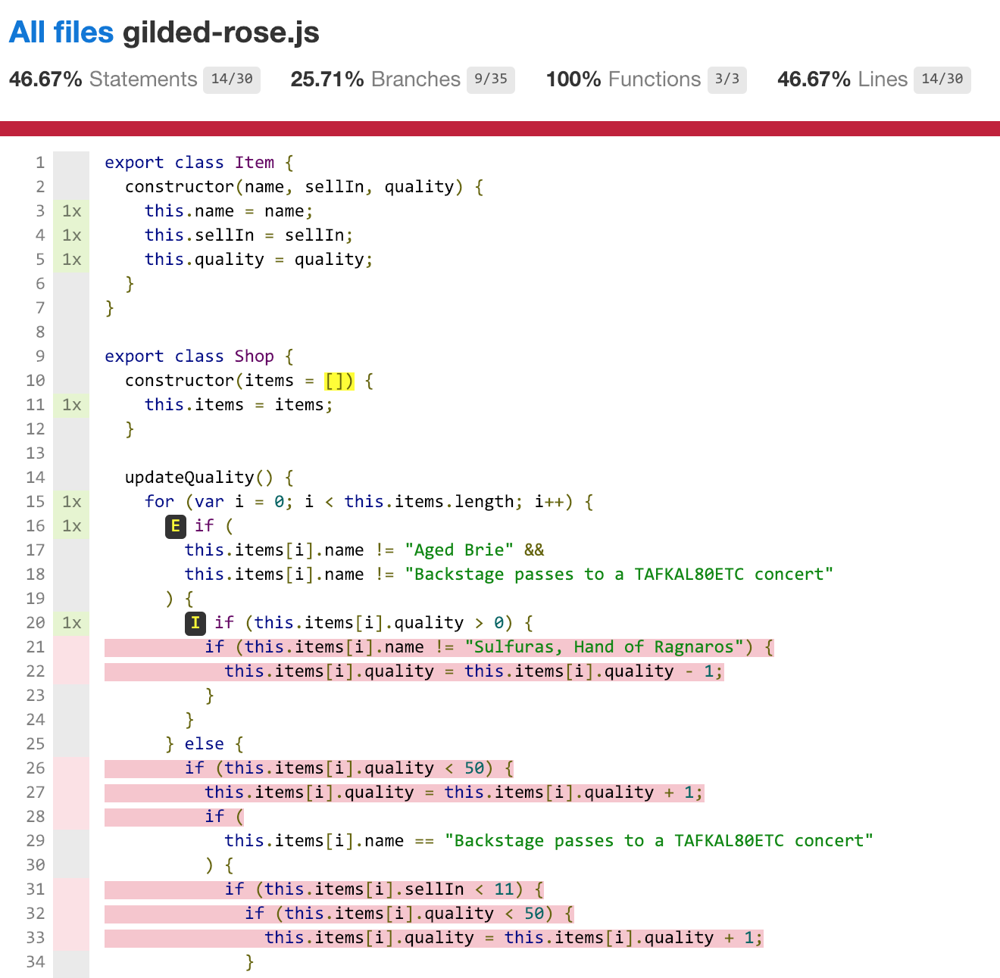
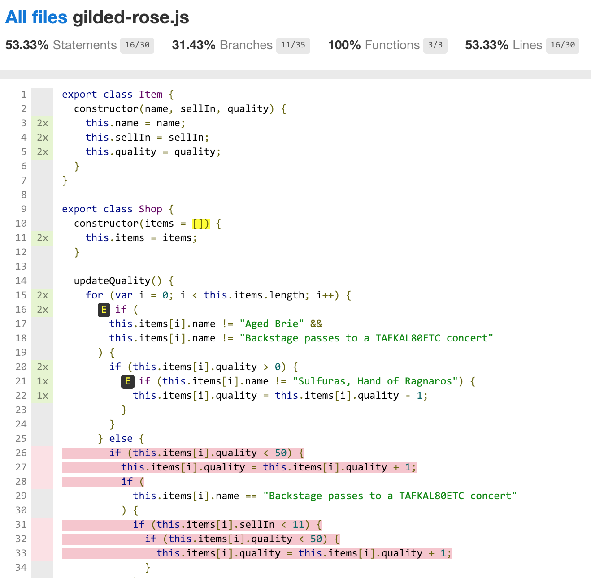
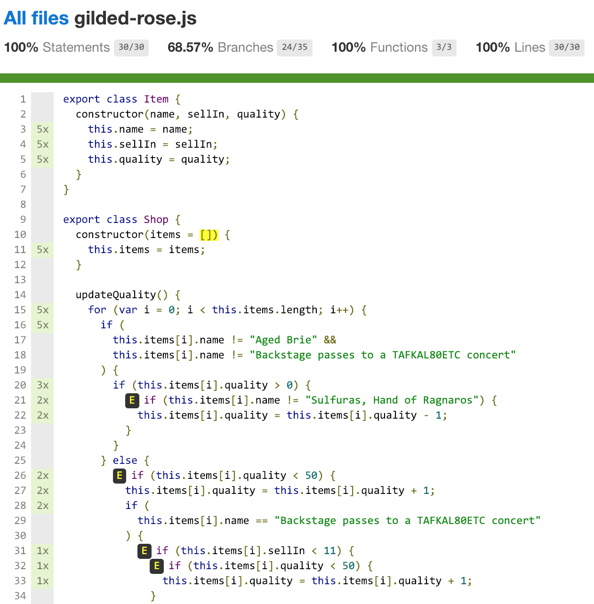
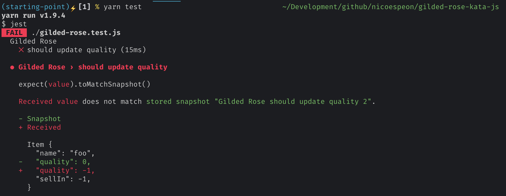
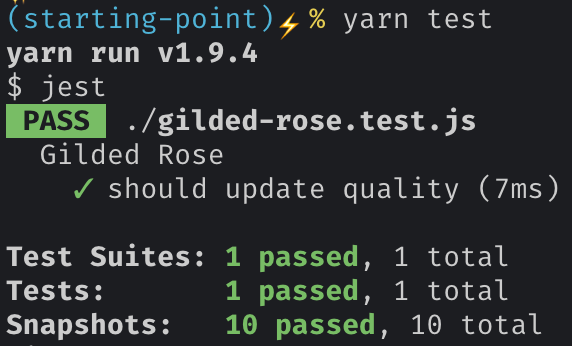
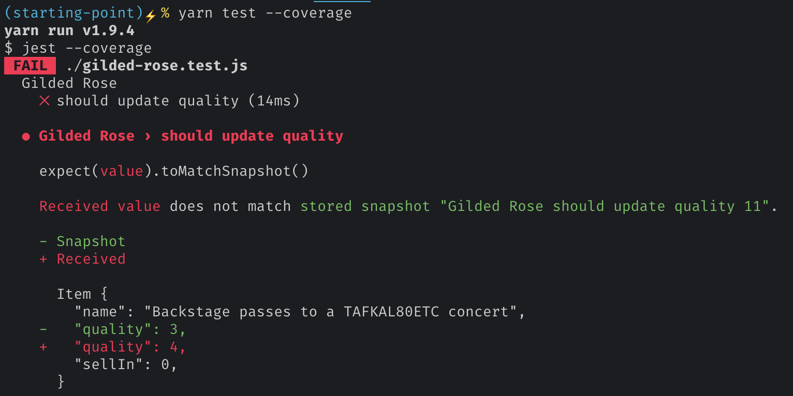

Here's the deal: you need to change the code to make this awesome new feature work, but that code is not covered by an automated test. How do you know you didn't break anything when you're done?

That's a typical scenario I frequently face.

I see different approaches in such a situation:

1. 🤞 **Cross fingers**, do the change and hope nothing breaks. Manually test different use cases you know. After all, you're just adding a feature. You know the codebase, more or less. What could go wrong?

2. 🤔 **Spend time to understand**, test and refactor the code before changing it. ["Make the change easy, then make the easy change"](https://twitter.com/kentbeck/status/250733358307500032). Sure, it will take some time. You didn't estimate that task to take that much time actually. That's unexpected complexity. But, in the end, you will leave codebase in a better state and you'll be able to go faster.

3. 📸 **Take a snapshot of existing code behavior**. Consider it a black box and capture enough of its behavior to feel confident touching it.

I clearly think the first approach is shooting yourself in the foot − except if you know you won't need to maintain that code. Heck, it seems you're maintaining this code already, otherwise, you wouldn't have this question in the first place! If you want to keep moving fast without breaking everything, there is a better, more professional way.

The second approach would be ideal. Working effectively with legacy code requires putting the existing code into a test harness, first. Then, you can refactor. But, it takes skills to write good tests. You should practice these skills though, they will help you with these – so common – scenarios. Now, I hear you: client demo is next week and you need to ship that cool feature before. You need a pragmatic solution to the problem. You're gonna take this shortcut consciously so you can deliver, then you'll pay the technical debt back. Now, are you stuck with approach #1 then?

Nope. Approach #3 is more… pragmatic. You have to put your code under test before you touch it anyway. But, who said you need to completely understand current code to do so? What you want is to know if you break existing behavior when you touch the code. This, you can do with **Approval Testing**.

The main idea is:

* take a snapshot of existing code behavior, in all possible variations
* use test coverage to discover parts of the code not covered with the variations
* use mutations to ensure you detect any broken behavior

**You don't need to understand existing code to do so.** That's the good news.

There is a pre-requisite though: you need to take a snapshot of your code behavior, meaning that you **should be able to stringify the output of your code**, including side-effects. If your codebase was not designed with tests in mind, you probably need to rely on [Michael Feather's book](https://www.oreilly.com/library/view/working-effectively-with/0131177052/) to help you get started.

Now, let see how you can do that in JavaScript.

## Approval Testing in JavaScript

My personal go-to for JavaScript testing nowadays is [Jest](https://jestjs.io/).

It is simple to set up – almost no configuration needed. It has a wonderful test runner baked in, with a powerful watch mode. Finally, and that's what you're looking for, it can take snapshots.

<figure>
  
  <figcaption>Jest runner in action – damn it's so cool!</figcaption>
</figure>

Snapshots are powerful. But they are a _test-after_ technique. I usually recommend to practice [Test-Driven Developement](https://en.wikipedia.org/wiki/Test_driven_development), so you should barely need snapshots. Actually, **snapshots have very few valid use-cases**. Putting tests on existing code, before refactoring it, is one of these.

Now, I need an example. I'll use the [Gilded Rose kata](http://iamnotmyself.com/2011/02/13/refactor-this-the-gilded-rose-kata/) to illustrate that. It's an exercise to practice refactoring techniques, which is really convenient here. I made a [JS starter](https://github.com/nicoespeon/kata-gilded-rose-js) of the kata that you can use.

So you have 2 classes: `Shop` and `Item`. `Item` is pretty simple:

```js
export class Item {
  constructor(name, sellIn, quality) {
    this.name = name
    this.sellIn = sellIn
    this.quality = quality
  }
}
```

Then you have `Shop` which takes a list of `items` and have a method `updateQuality()` that will update the `quality` and `sellIn` attributes of every item. There is a bunch of logic that's currently supposed to work. It is not pretty though, so I won't put it here but give you [a link to the beast](https://github.com/nicoespeon/kata-gilded-rose-js/blob/954274fb04741e9c2992f9b31482daca366e0055/gilded-rose.js#L14-L69) instead.

Your goal: change `updateQuality()` so it deals with `"Conjured"` items too (they degrade in quality twice as fast as normal items).

There is no test. A good idea is to refactor this code first – make the change easy, remember?

Let me show you how to apply the Approval Testing technique in such a scenario.

### 1. Generate an output you can snapshot

The first step is to generate a snapshot from `updateQuality()`. It doesn't return a string, but it changes `items`. Thus, my first move is to write a function returning something which captures the changes so Jest can take a snapshot of it:

```js
// I put that code in my test file, since it's test-related.

function doUpdateQuality(name, sellIn, quality) {
  const gildedRose = new Shop([new Item(name, sellIn, quality)])
  const items = gildedRose.updateQuality()
  return items[0]
}
```

I could have returned `items`, but I'm simplifying things a bit here: I'm only testing a shop with one item. That's because I already know the behavior is the same regardless the number of items. It might not be your case. You should adapt to your situation, this is the tricky part.

Now I have a `doUpdateQuality(name, sellIn, quality)` I can call from my tests. It will instantiate the shop, call the method I'm testing and return me the updated item.

My next move is to write the first test, taking a snapshot from the output:

```js
it('should update quality', () => {
  expect(doUpdateQuality('foo', 0, 0)).toMatchSnapshot()
})

function doUpdateQuality(name, sellIn, quality) {
  // …
}
```

If you're not familiar with Jest snapshot testing, I suggest you take a few minutes to have a look at [their documentation](https://jestjs.io/docs/en/snapshot-testing#snapshot-testing-with-jest). I will wait 😉

### 2. Using test coverage to find all input combinations

At this point, I generated a first snapshot, given a set of parameters. Jest will tell me if any regression happens to that scenario. Can I go refactor `updateQuality()` now? Nope. Because I'm not covering all the code with this snapshot. This, I can know thanks to the test coverage!

To generate test coverage, I run Jest with the `--coverage` option.

I find the `html` report to be the best in this scenario. To do so, I need to configure Jest options. This can be done in a config file, or quickly in `package.json`:

```json
{
  "name": "gilded-rose-kata",
  // …
  "scripts": {
    "test": "jest"
  },
  "jest": {
    "coverageReporters": [
      "html"
      // I could add "text" or "text-summary" to see output in the console
    ]
  }
}
```

Then, I run `yarn test --coverage` (or `npm run test -- --coverage`), which generates a `coverage/` folder.

I open the `coverage/index.html` file:



All the red lines, I don't test.

<figure>
  <blockquote>
    <p>Test coverage can only tell you<br>what code is not tested, nothing else.</p>
  </blockquote>
</figure>

Let's figure out another combination that would cover more lines… An item with a positive quality should do:

```js
it('should update quality', () => {
  expect(doUpdateQuality('foo', 0, 0)).toMatchSnapshot()
  expect(doUpdateQuality('foo', 0, 1)).toMatchSnapshot()
})

function doUpdateQuality(name, sellIn, quality) {
  // …
}
```

I run the test again. A new snapshot is generated.

Coverage report is updated:



Yay, less red lines!

So you get the idea: during this phase, I need to find all the possible combinations that would cover all the code. No more red lines.

Let's fast-forward a bit. Here's what I've got:

```js
it('should update quality', () => {
  expect(doUpdateQuality('foo', 0, 0)).toMatchSnapshot()
  expect(doUpdateQuality('foo', 0, 1)).toMatchSnapshot()
  expect(doUpdateQuality('foo', 0, 2)).toMatchSnapshot()
  expect(doUpdateQuality('Aged Brie', 0, 1)).toMatchSnapshot()
  expect(
    doUpdateQuality('Backstage passes to a TAFKAL80ETC concert', 0, 1)
  ).toMatchSnapshot()
})
```



No more red lines, but I still have these `E` symbols. These symbols mean that I'm covering the `if` case, but I'm missing the `else` clause – that's why only 68.57% of branches are covered. I need to cover them too:

```js
it('should update quality', () => {
  expect(doUpdateQuality('foo', 0, 0)).toMatchSnapshot()
  expect(doUpdateQuality('foo', 0, 1)).toMatchSnapshot()
  expect(doUpdateQuality('foo', 0, 2)).toMatchSnapshot()
  expect(doUpdateQuality('Aged Brie', 0, 1)).toMatchSnapshot()
  expect(doUpdateQuality('Aged Brie', 0, 50)).toMatchSnapshot()
  expect(doUpdateQuality('Sulfuras, Hand of Ragnaros', 0, 1)).toMatchSnapshot()
  expect(doUpdateQuality('Sulfuras, Hand of Ragnaros', -1, 1)).toMatchSnapshot()
  expect(
    doUpdateQuality('Backstage passes to a TAFKAL80ETC concert', 0, 1)
  ).toMatchSnapshot()
  expect(
    doUpdateQuality('Backstage passes to a TAFKAL80ETC concert', 11, 1)
  ).toMatchSnapshot()
  expect(
    doUpdateQuality('Backstage passes to a TAFKAL80ETC concert', 0, 49)
  ).toMatchSnapshot()
})
```

So far, so good. I'm covering every line and branch. Can I go refactor `updateQuality()` now?

Well… not yet. Remember when I said test coverage can only tell you "what code is not tested"? That means it doesn't tell you if the covered code is properly tested.

This is why setting a test coverage objective to ensure test quality doesn't work. Test coverage tells you parts that are not tested – and that might be fine not to test these parts. Other than that, it says nothing.

To me, good test coverage comes as a side-effect of a good testing strategy (TDD). It's not a target.

### 3. Use mutations to verify snapshots

To ensure the covered code is actually tested, I'm gonna introduce little mutations in the code.

The goal here is to see the test fail. If I change the existing code and a test fail, I'll feel safe refactoring this code! When the test has failed, I revert the mutation and move to another line.

What mutations should you introduce? Again, it depends on what you're testing – sorry. Usually, mutate the side-effects that you're capturing in your snapshot. In my case, that means I don't have to change `if`s, but only the updates to `item`. There are 8 of them.

Let's start with the first assignment, line 22:

```js
if (this.items[i].name != 'Sulfuras, Hand of Ragnaros') {
  this.items[i].quality = this.items[i].quality - 1
}
```

I'll introduce a little mutation, just to check:

```js
if (this.items[i].name != 'Sulfuras, Hand of Ragnaros') {
  this.items[i].quality = this.items[i].quality - 2
}
```

I run my tests again:



Great! I know my test will catch any regression here. I can revert my mutation.

Let's move on the other ones. I introduce a similar mutation line 33:

```js
if (this.items[i].quality < 50) {
  this.items[i].quality = this.items[i].quality + 2
}
```

Run tests again and…



That's not good.

Before going further, I revert the mutation in the code. **Don't let mutations live long.**

Then, at that point, I need to think a bit about the code – yeah, I lied, but you don't have to understand _all_ the code. How could this happen? I suspect that a further update makes me take another path in the following logic, resulting in a similar result with my given combinations. Looking at the lines of code I want to mutate, I find this one to be interesting:

```js{2}
if (this.items[i].name != 'Sulfuras, Hand of Ragnaros') {
  this.items[i].sellIn = this.items[i].sellIn - 1
}
if (this.items[i].sellIn < 0) {
  // …
}
```

That means if `sellIn` is `0`, then it doesn't execute the rest of the code. I try to add another combination:

```js{22-24}
it('should update quality', () => {
  expect(doUpdateQuality('foo', 0, 0)).toMatchSnapshot()
  expect(doUpdateQuality('foo', 0, 1)).toMatchSnapshot()
  expect(doUpdateQuality('foo', 0, 2)).toMatchSnapshot()
  expect(doUpdateQuality('Aged Brie', 0, 1)).toMatchSnapshot()
  expect(doUpdateQuality('Aged Brie', 0, 50)).toMatchSnapshot()
  expect(doUpdateQuality('Sulfuras, Hand of Ragnaros', 0, 1)).toMatchSnapshot()
  expect(doUpdateQuality('Sulfuras, Hand of Ragnaros', -1, 1)).toMatchSnapshot()
  expect(
    doUpdateQuality('Backstage passes to a TAFKAL80ETC concert', 0, 1)
  ).toMatchSnapshot()
  expect(
    doUpdateQuality('Backstage passes to a TAFKAL80ETC concert', 11, 1)
  ).toMatchSnapshot()
  expect(
    doUpdateQuality('Backstage passes to a TAFKAL80ETC concert', 0, 49)
  ).toMatchSnapshot()
  expect(
    doUpdateQuality('Backstage passes to a TAFKAL80ETC concert', 1, 0)
  ).toMatchSnapshot()
})
```

I generate the new snapshot, then retry the mutation:




It worked!

I revert my mutation and continue to the next assignment. I do that until I know all of them are _actually_ covered with tests.

Hopefully, I didn't found other false positive for coverage. Here's the final list of tests:

```js
it('should update quality', () => {
  expect(doUpdateQuality('foo', 0, 0)).toMatchSnapshot()
  expect(doUpdateQuality('foo', 0, 1)).toMatchSnapshot()
  expect(doUpdateQuality('foo', 0, 2)).toMatchSnapshot()
  expect(doUpdateQuality('Aged Brie', 0, 1)).toMatchSnapshot()
  expect(doUpdateQuality('Aged Brie', 0, 50)).toMatchSnapshot()
  expect(doUpdateQuality('Sulfuras, Hand of Ragnaros', 0, 1)).toMatchSnapshot()
  expect(doUpdateQuality('Sulfuras, Hand of Ragnaros', -1, 1)).toMatchSnapshot()
  expect(
    doUpdateQuality('Backstage passes to a TAFKAL80ETC concert', 0, 1)
  ).toMatchSnapshot()
  expect(
    doUpdateQuality('Backstage passes to a TAFKAL80ETC concert', 11, 1)
  ).toMatchSnapshot()
  expect(
    doUpdateQuality('Backstage passes to a TAFKAL80ETC concert', 0, 49)
  ).toMatchSnapshot()
  expect(
    doUpdateQuality('Backstage passes to a TAFKAL80ETC concert', 1, 0)
  ).toMatchSnapshot()
})
```

Can I go refactor `updateQuality()` now?

Yes! All the code is now covered by snapshots. A wrong move and I'll automatically know that. I can now refactor the code without introducing bugs. Then I'll add the feature 🤘

### 4. These tests are technical debt

If you apply this recipe, remember this: you accepted to take technical debt here. You traded well-written tests against snapshots of existing behavior to get a test harness faster so you can refactor.

Snapshots are powerful, but they don't help you understand what the code is supposed to do. Once the code is refactored, you should pay the debt back: write proper, comprehensive tests on your clean code to replace your snapshots. If you do so, this part of the codebase will be easier to maintain in the future, and you'll add new features faster.

## Introducing jest-extended-snapshot

Looking at the resulting test code, I thought that was a lot of boilerplate code in a single `it`!

So I refactored it with a custom Jest matcher: `toVerifyAllCombinations()`.

With it, the previous code could be written the following:

```js
it('should update quality', () => {
  expect(doUpdateQuality).toVerifyAllCombinations(
    [
      'foo',
      'Aged Brie',
      'Backstage passes to a TAFKAL80ETC concert',
      'Sulfuras, Hand of Ragnaros',
    ],
    [-1, 0, 1, 11],
    [0, 1, 2, 49, 50]
  )
})
```

It will generate all possible combinations of the following arguments, call `doUpdateQuality()` with each and take a snapshot of all results.

I like it because it expresses the intention better: "current behavior should be preserved for all these scenarios".

I extracted that into a library so you can use it too: [jest-extended-snapshot](https://github.com/nicoespeon/jest-extended-snapshot#readme) 👹

## Inspiration

I discovered Approval Testing thanks to [Emily Bache](https://twitter.com/emilybache). She made a very nice 20-min screencast where she runs a demo of this very example, in Java:

<iframe width="560" height="315" src="https://www.youtube.com/embed/zyM2Ep28ED8" frameborder="0" allow="accelerometer; autoplay; encrypted-media; gyroscope; picture-in-picture" allowfullscreen></iframe>

You can read more about Approval Testing on http://approvaltests.com/.

They have a library to do that in JS, with Mocha: https://github.com/approvals/Approvals.NodeJS
