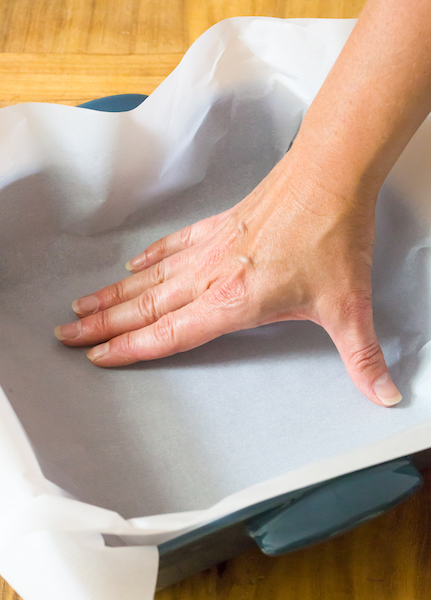
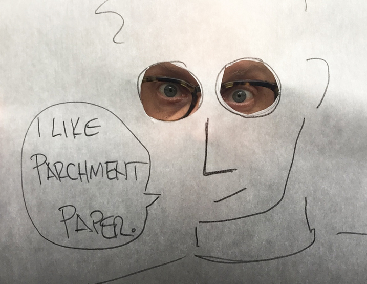

Today _aha moment_ is cooking related 👨‍🍳

I usually use parchment paper to protect baking sheets and the like—essentially when I bake cakes, cookies, and other niceties 🍪

Sometimes, I also struggle to make it fit the recipient. Especially when it goes 3D. I used to measure and cut to adapt. But overall, it's not really convenient.

<figure>
	
  <figcaption>Making the paper fits the recipient properly can be painful. Credits <a href="https://thepioneerwoman.com/food-and-friends/7-reasons-to-use-parchment-paper/" rel="nofollow noopener">The Pioneer Woman</a>.</figcaption>
</figure>

Today, I learned that you can actually **wet the parchment paper and crumple it** to make this easy! Parchment paper is strong, even when it's wet. Crumple it, put it under water, press it to eliminate the excess of water then unfold it. It will be easier to make it fit the recipient you want to protect.

Also, I learned that you can use it almost any time a recipe tells you to put some butter on your cake mold. Wet parchment paper will do the trick faster and leave the mold in a cleaner state—so you can reuse more quickly if you need to.

And voilà!

<figure>
	
  <figcaption>Credits <a href="https://altonbrown.com/parchment-paper-vs-wax-paper/" rel="nofollow noopener">Alton Brown</a>.</figcaption>
</figure>

**And you, do you have tips & tricks for cooking?**
