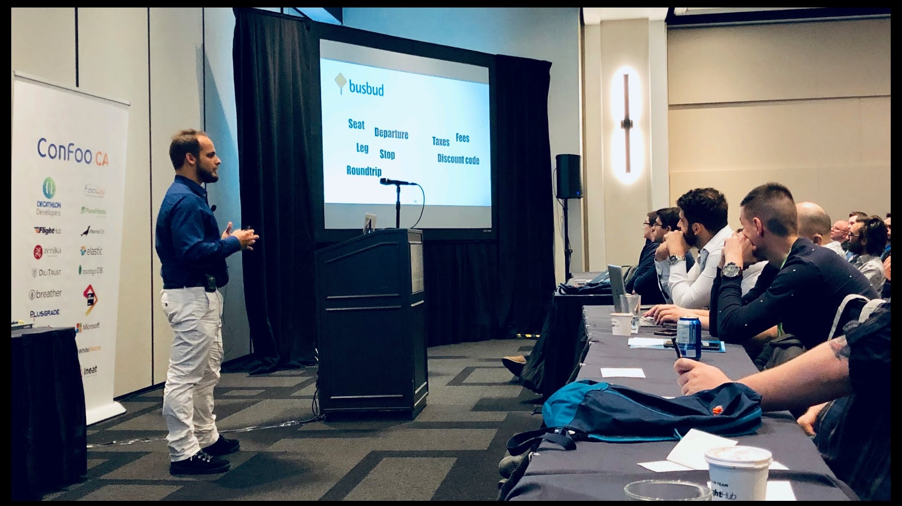

If there is one thing you should retain from my talk, it’s that **you should separate the Domain from the Infrastructure if you want to write maintainable software**.

<figure>
	
  <figcaption>Giving the talk at ConFoo Montréal 2019.</figcaption>
</figure>

The Domain is the business part. Today, I work at [Busbud](https://www.busbud.com/). We sell intercity bus tickets, worldwide. We talk about things like Seat, Departure, Leg, Stop, Roundtrip… These are specific to our business, and we understand this vocabulary in a given context. We also have Taxes, Fees, Discount Code that you probably have to. This is a more generic Domain for us, but it’s still business.

The Infrastructure part is how is our current solution made. Fastly, Postgres databases, Redis instances, Express server, React… All of these technologies we use to provide busbud.com to travellers across the planet. But we could change the infrastructure, still we do the same business.

The Hexagonal Architecture is the simplest way to do this separation. Put your Domain at the heart of your software. Make your Infra depends on your Domain, and your Domain not depending on your Infra. Use business vocabulary inside the Domain part, to define intention-revealing interfaces (aka Ports). Build concrete implementations of these interfaces in your Infra (aka Adapters). That gives you the flexibility to plug any adapter to your domain.

It makes testing easy. It allows you to start with something simple, and evolve the infrastructure when actually needed. Finally, It’s a good first step towards Clean Architecture.

Here are the slides of the talk:

<iframe src="//www.slideshare.net/slideshow/embed_code/key/Mj96vePpslBlHM" width="595" height="485" frameborder="0" marginwidth="0" marginheight="0" scrolling="no" style="border:1px solid #CCC; border-width:1px; margin-bottom:5px; max-width: 100%;" allowfullscreen> </iframe> 
 <strong> <a href="//www.slideshare.net/nicolascarlo1/the-secrets-of-hexagonal-architecture" title="The Secrets of Hexagonal Architecture" target="_blank">The Secrets of Hexagonal Architecture</a> </strong> de <strong><a href="https://www.slideshare.net/nicolascarlo1" target="_blank">Nicolas Carlo</a></strong> 

I also gave that talk at Bulgaria PHP 2019, and it was recorded:

<iframe width="560" height="315" src="https://www.youtube-nocookie.com/embed/iQE_XDJVAZA?si=F9CvDms8b4Ay-VAX" title="YouTube video player" frameborder="0" allow="accelerometer; autoplay; clipboard-write; encrypted-media; gyroscope; picture-in-picture; web-share" allowfullscreen></iframe>
