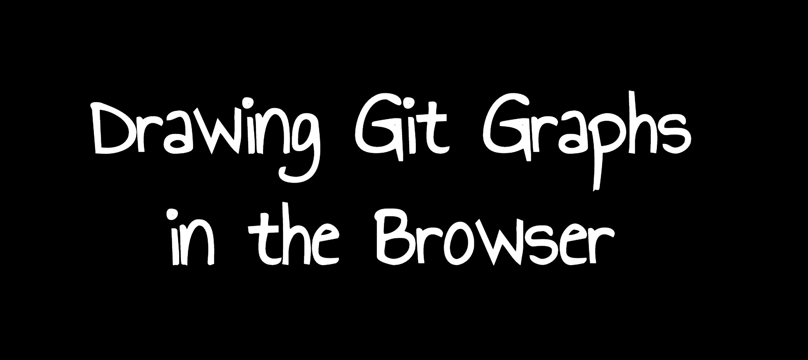

In this talk I presented a side-project that I've been developing with my friend [Fabien Bernard][fabien0102] since 2013: [GitGraph.js][gitgraph.js] 🎉

It's a JS library that allows you to draw git graphs in the browser. Very handy to prepare presentations or write blog posts. Creating and updating those git illustrations becomes easy!

I already [wrote about GitGraph.js in the past](/en/2013/11/gitgraphjs/).

If there is one thing you should retain from my talk, it’s that **you can hack your own problems**. You certainly have this crazy idea in mind, that problem you want to solve for yourself… Stop waiting the perfect moment, just start doing it. **Good things will happen!**

<iframe src="https://player.vimeo.com/video/336845529" width="640" height="360" frameborder="0" allow="autoplay; fullscreen" allowfullscreen></iframe>

Click on the following image to access the slides:

The project is available on GitHub: <https://github.com/nicoespeon/gitgraph.js/>

Different libraries are available:

* [`@gitgraph/js`](https://www.npmjs.com/package/@gitgraph/js) for the vanilla JS version
* [`@gitgraph/react`](https://www.npmjs.com/package/@gitgraph/react) for the React version
* There is a [browser bundle](https://github.com/nicoespeon/gitgraph.js/tree/master/packages/gitgraph-js#browser-bundle-ready-to-use) you can use directly in the browser 💪

If you want to play with the GitGraph.js, have a look at the online playground:

<iframe height="722" style="width: 100%;" scrolling="no" title="@gitgraph/js playground" src="//codepen.io/nicoespeon/embed/preview/arqPWb/?height=722&theme-id=dark&default-tab=js,result" frameborder="no" allowtransparency="true" allowfullscreen="true">
  See the Pen <a href='https://codepen.io/nicoespeon/pen/arqPWb/'>@gitgraph/js playground</a> by Nicolas Carlo
  (<a href='https://codepen.io/nicoespeon'>@nicoespeon</a>) on <a href='https://codepen.io'>CodePen</a>.
</iframe>

[fabien0102]: https://twitter.com/fabien0102
[gitgraph.js]: https://gitgraphjs.com
