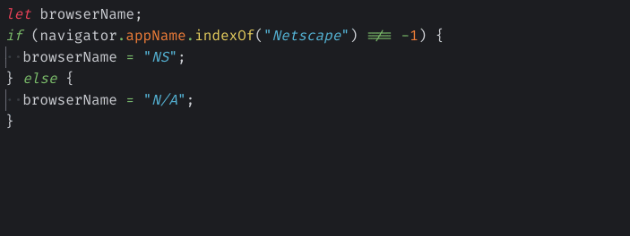
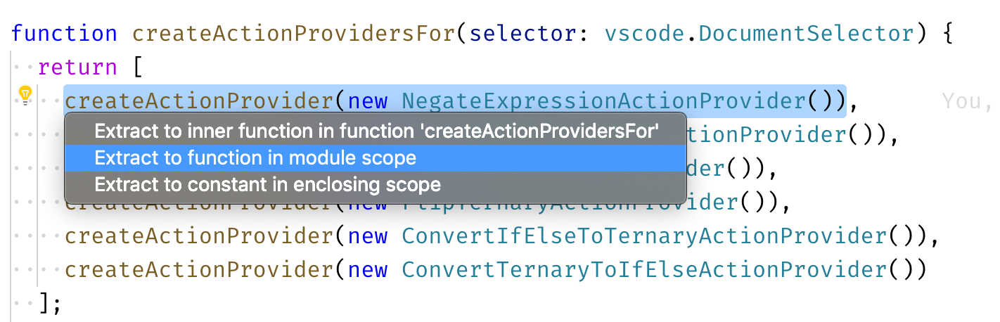
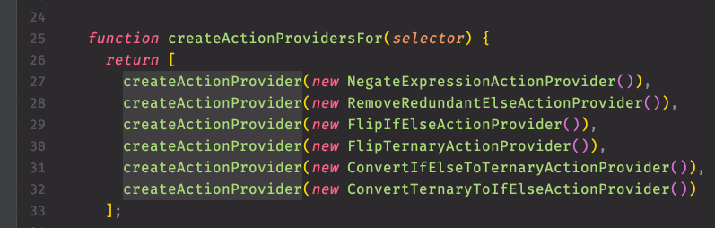
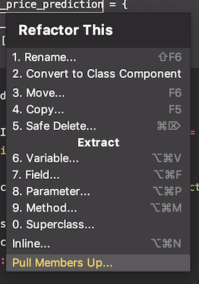
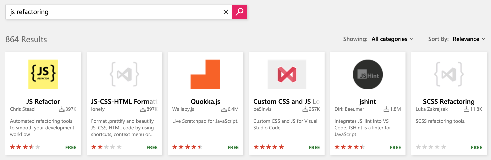
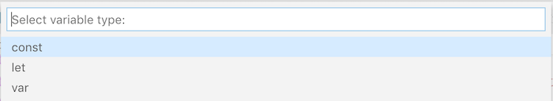
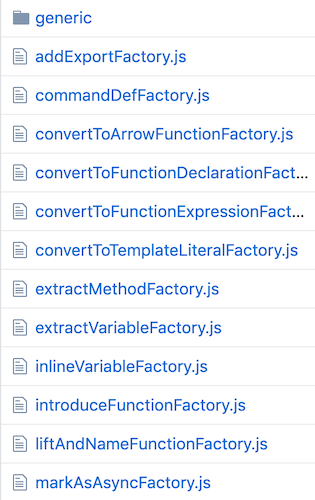

I use VS Code every day. I use it exclusively since February 2018, both personally and professionally. I like it a lot.

But I am _frustrated_.

I am frustrated because I miss a **great** tool to perform **automated refactorings** for me. And neither VS Code, neither existing extensions provide the experience I'm looking for!


Thus, 2 months ago, I decided to follow [my own advice](/en/2019/06/drawing-git-graphs-browser/) and hack my own problem. I started creating the VS Code extension I was looking for. This extension analyzes my code, suggests refactorings and executes them with the minimal amount of keystrokes needed. **It helps me focus on my intention instead of manually following the scripted mechanics of a refactoring.**

<figure>
  <blockquote>
    <p>I called this extension: <a href="https://marketplace.visualstudio.com/items?itemName=nicoespeon.abracadabra">Abracadabra</a> ✨</p>
  </blockquote>
</figure>



## Why wasn't I satisfied with VS Code refactorings?

It's true that VS Code ships with [basic refactoring operations](https://code.visualstudio.com/docs/editor/refactoring). So what's wrong?

Well, speaking from a personal point of view, few things aren't great:

* There are a lot of automated refactorings that I know and aren't proposed. I need more than that.
* To get an appropriate suggestion requires selecting _exactly_ the code to refactor. I can't just have the cursor on a variable and trigger an extraction. I need to select the whole extracted statement first, which is slowing me down.
* I don't like the UX much. Talking about extraction, I often feel confused in front of all the suggested options. I need to play the computer in my head and decipher what "enclosing scope" vs. "module scope" means in terms of the resulting code. I _know_ that there is a better way.

<figure>
	
	<figcaption>I understand what it means, but it takes precious seconds to process. Don't make me think!</figcaption>
</figure>

Before using VS Code exclusively, I used Webstorm professionally for a few years. And I prefer VS Code: it's free, feels lighter to use and has a very active community. But there is one thing Webstorm nailed that VS Code doesn't provide: many, intuitive, automated refactorings.





This made me so productive back in the days. I relied on my editor to move fast.

And I think it matters. If refactoring code takes 2 keystrokes I'm more likely to do it than if I have to do it by hand, or if I have to find the correct combination of 5 keystrokes to make it work. Great automated refactorings are a productivity boost for every developer.

## But wait, wasn't there an extension already?

Yes! And I used it for some time. Well… I tried to.

I essentially work with JavaScript (and TypeScript). If you [search for "JS refactoring" on VS Code Marketplace](https://marketplace.visualstudio.com/search?term=js%20refactoring&target=VSCode&category=All%20categories&sortBy=Relevance), you'll find a promising extension called "JS Refactor":



I appreciate the good efforts that were put in it. At least someone worked to provide more refactorings, shared that for free and maintained it. But it's not exactly what I'm looking for, for a few reasons:

* It still misses a lot of refactorings I'm looking for. In fact, it doesn't have many. The way it performs operations like "Add Export", "Negate Expression" or "Wrap Selection", even if they're handy, is not refactoring because they modify code behavior.
* It often tended to just _not work_. Until very recently, it would fail if I had a JS class in the file. Still today, it doesn't work on TypeScript code.
* It provides features I'm not looking for (I don't want code snippets, I want refactorings)
* Selection doesn't have to be as precise as VS Code. It understands what you want to do with a partial selection. Though I still can't "just have the cursor inside" and make it work.
* The UX is still not the one I expect. It requires too many keystrokes for me to extract a variable.

<figure>
  
  <figcaption>"Extract Variable" scope is clearer than VS Code</figcaption>
</figure>

<figure>
  
  <figcaption>Hmmm 99% of the time I extract a variable, it's a const. Don't ask me every time!</figcaption>
</figure>

<figure>
  
  <figcaption>Having 3 popups before extracting feels like it's not trivial. It adds friction.</figcaption>
</figure>

At that point, I thought:

> OK, maybe I can contribute and improve it!

Heading to [the repository](https://github.com/cmstead/js-refactor), I was really happy to see it seemed well tested. But I felt the architecture was not quite what I'd have in mind:



I think abstractions are great, as long as "[their purpose] is not to be vague, but to create a new semantic level in which one can be absolutely precise" as Dijkstra said. To me, too many "factories" adds a lot of indirection for which I can't figure out the added value. For example:

```js{4}
// add-export-factory.js
function addExportFactory(
  coordsHelper,
  editActionsFactory,
  logger,
  parser,
  selectionExportHelper,
  selectionExpressionHelper,
  templateHelper,
  vsCodeHelperFactory
)
```

```js{3}
// edit-actions-factory.js
function editActionsFactory(
  editFactory,
  vscodeFactory
)
```

```js
// edit-factory.js
function editFactory(editApiFactory)
```

```js
// edit-api-factory.js
function editApiFactory(vscodeFactory)
```

Abstracting VS Code API so we isolate our domain logic from the actual platform brings a lot of value. But, in my opinion, all of the intermediate factories make the code more difficult to reason about.

So, I was not really satisfied with the extension, neither aligned with the overall design of the code—but I respect the choice of the author, whatever works best for him! That's when popped up in my head the idea of scratching my own itch and build my own.

## Abracadabra!

That's why, 2 months ago, I started to build this extension.

My goal is essentially to build the tool I'm missing. A side-effect for me is the learning part. Digging into [Abstract Syntax Trees](https://en.wikipedia.org/wiki/Abstract_syntax_tree) manipulations is super interesting. Also, I'm discovering how to build a VS Code extension for the first time. Finally, it's a playground for me to test architectural decisions and practices, like [documenting architectural decisions through ADRs](https://github.com/nicoespeon/abracadabra/tree/master/docs/adr).

I implemented a couple of refactorings across these 2 months. I published the extension a few days ago [on the Marketplace](https://marketplace.visualstudio.com/items?itemName=nicoespeon.abracadabra).

I still consider it under "initial development" phase. I'm waiting for feedback to improve these first refactorings. Next steps include adding more refactorings (I've got a bunch I want to implement), fixing edge cases that I still didn't consider and improving the UX to match what I expect from a **great** extension!


### What about you?

Well first, if you do JavaScript or TypeScript and you're looking for great automated refactorings, you can [give Abracadabra a try](https://marketplace.visualstudio.com/items?itemName=nicoespeon.abracadabra)!

Then, if you want to help me, you can:

* Give me your feedbacks on what you like and what you'd like to improve. Whether you find a bug, have a suggestion or just want to share something, [have a look at existing issues or open a new one](https://github.com/nicoespeon/abracadabra/issues).
* If you'd like to contribute, you can start with the ["Good First Issues" I've listed](https://github.com/nicoespeon/abracadabra/issues?q=is%3Aissue+is%3Aopen+label%3A%22%3Awave%3A+Good+first+issue%22). Any kind of contribution is welcomed 🙂
* Spread the word so I can get more use-cases and more feedbacks to improve the extension!

That's it. I'm really excited about this, about happy to start spreading the word.

Now, _I feel better_.


