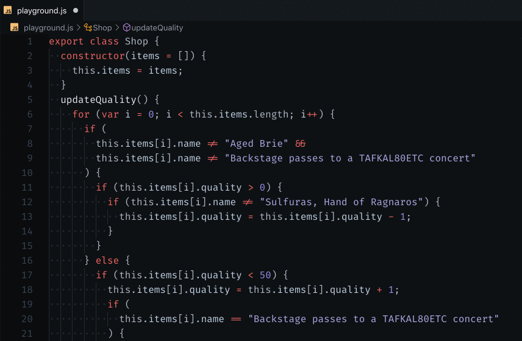
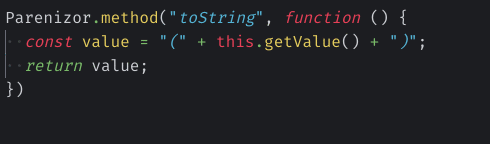
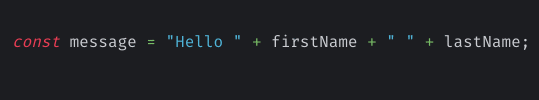
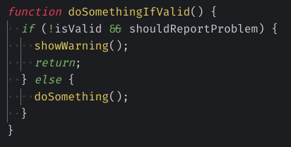

Hello there 👋

Refactoring code. Changing the way code is written, without breaking it. This is something I do constantly. I do it for many reasons, usually as preparatory work for further changes.

Today, I want to share with you the refactorings I use every day!

Because I apply these refactorings so often, I need them to be fast and reliable. Being a VS Code user, I developed an Extension to automate the refactorings for me, in an intuitive way. I called this extension [Abracadabra](http://bit.ly/vscode-abracadabra). The following examples will use the extension to illustrate, but refactorings can be done by hand too, regardless of the language you're working with.

## Extract Variable

This is certainly the most frequent refactoring I do! Extract things into variables allows me to name the concepts and make the code easier to read.

When concepts are named, they can be reused. This is a solution to prevent logic duplication.

To extract any variable, I put my cursor on the variable and hit Abracadabra default shortcut: `⌘ ⌥ V` (`Ctrl Alt V` if you're not on Mac).

Since it works wherever my cursor is inside the variable I want to extract, it's quite convenient to use. I simply have to _think_ about extracting this thing into a variable, and here I am, naming this.

It also detects when there are multiple occurrences, so I can remove the duplication in the same shot!

## Inline Variable

The opposite refactoring. They go in pairs.

Sometimes, a variable is not reused and its name doesn't bring much value. If I can't find a better name, then inlining it is an option I'd consider.

The typical scenario is temporary, intermediate variables. They often have poor names. They might have been valid before, but after some other refactorings they have become unnecessary and they just add noise.

In that situation, I put my cursor somewhere in the variable I want to inline. Then I press `⌘ ⌥ N` (`Ctrl Alt N` if not on a Mac) and it gets inlined for me:

## Rename Symbol

This one is a classic.

Actually, it's a first-class refactoring in VS Code. The editor does it pretty well: I simply put my cursor on a symbol (like a variable name) and press `F2`. That makes me enter "rename mode". Enter a better name, press enter and the editor will rename all references to that symbol.

It's faster and more reliable than renaming using search and replace.

## Convert To Template Literal

This one is specific to JavaScript.

So, it turns out I frequently need to convert a regular string into a template, so I can put variables in it. However, I find the backtick symbol a bit annoying to use with my keyboard—which is a [bépo one, optimized for the French language](https://ccm.net/faq/32759-bepo-a-keyboard-layout-optimized-for-the-french-language). I need to press the key twice to enter the symbol, otherwise, it might merge it with the next letter. Thus, I'm glad I can trigger the conversion with a simple shortcut!

With Abracadabra, whenever my cursor is on a string, VS Code shows me a little bulb icon 💡. That's a [Code Action, commonly known as "Quick Fix"](https://code.visualstudio.com/docs/editor/refactoring#_code-actions-quick-fixes-and-refactorings). It works because Abracadabra detects that a refactoring can be made here. The Quick Fix is a shortcut to execute that refactoring!

I recommend you to **put a shortcut that's easy for you to trigger Quick Fixes**, so you don't have to aim and click on the lightbulb. To do so, look for the `editor.action.quickFix` command in your VS Code keycap configuration. I put `⌥ Enter` because I was used to this shortcut with Webstorm. The habits stuck when I moved to VS Code.

By the way: it also works on any part of a concatenated string. This is useful when I update some old code that didn't use template strings.

## Remove Redundant Else

Finally, I use this refactoring when I want to unnest some code logic, to make it more readable. I prefer to use [guard clauses](https://refactoring.guru/replace-nested-conditional-with-guard-clauses) instead of nested conditionals.

Again, as a lot of Abracadabra refactorings, it's a Quick Fix. This is nice because I only have to care about it when I can perform this refactoring. Looking at a piece of code, the extension tells me what refactorings can be executed. Less cognitive load for me.

## What refactorings do _you_ use every day?

That's it. These are the 5 refactorings I use the most.

Through these, I wish I was able to illustrate why I developed Abracadabra and how it serves me every day!

What about you? Do you refactor often? What are the refactorings you do frequently? Did you learn something from this post? Let me know!
