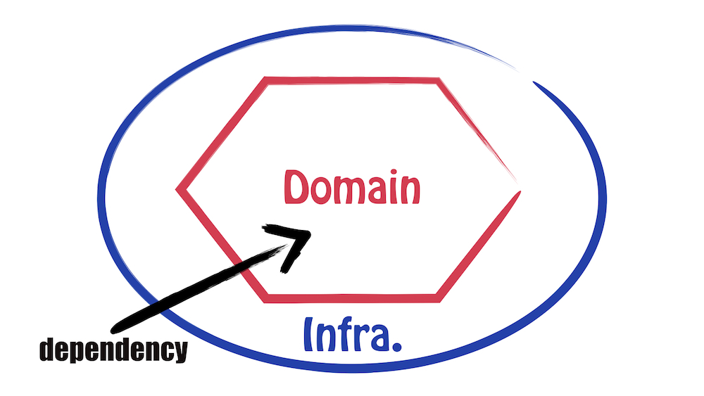
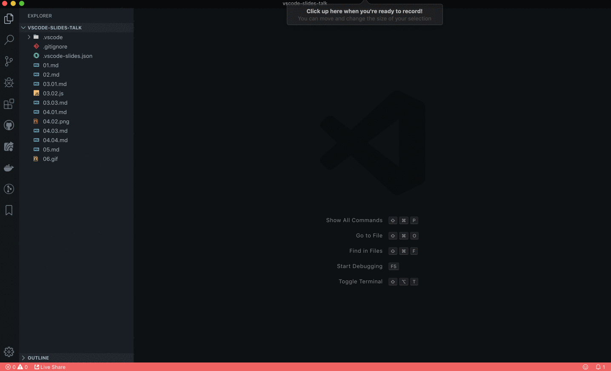

Last week, [I spoke at Bulgaria PHP 2019](https://www.bgphp.org/speakers/). After [the great feedback I got](https://joind.in/event/bulgaria-php-conference-2019/the-secrets-of-hexagonal-architecture), a few people asked me about my "original delivery" of the talk. Indeed, instead of using a regular presentation tool, I did everything from my code editor: Visual Studio Code.

Here's the why and how I did that, so I can just refer to it instead of repeating my explanations. Hopefully, it will inspire you to do the same. I really think this is a powerful format for technical talks.

## VS Code as a presentation tool. But, why?


Well, I got inspired by [Kent C. Dodds' talk on "Managing an Open Source Project"](https://www.youtube.com/watch?v=zCJyiBu12Jw link to tweet). I read [the original blog post from André Staltz](https://staltz.com/your-ide-as-a-presentation-tool.html) and I liked it a lot. I recommend you to read it, but here's my recap:

* What really matters in a technical talk, is **the content**. Using your code editor really helps focus on what matters. You don't go fancy on animations and all, you deliver the content.
* When you explain technical concepts with code, it's better to **show that in action**. Live-code it from a blank file. Show people there's no black magic and what you say actually works.
* It helps people understand your message. It really just feels like you're showing a colleague how to do something.
* If you want to show code, it's even better to stay in your code editor than switching from a presentation tool.
* You can still show images if you need to.

My talk was about "The Secrets of Hexagonal Architecture". I wanted people to understand what's the universally true axiom behind a maintainable codebase, regardless of the language, the architecture or the tooling. Thus, I wanted to show the code. I needed to illustrate the theory with concrete, working examples.

That's why I decided to use exclusively VS Code for this presentation. And **it was great!**

Now, I learned a few things along the way. If you want to do the same, I think it'd be helpful I share that with you 😉

## How to build a great presentation with VS Code

Putting the theory aside, here's my recipe to build a nice talk using VS Code only:

1. Raw content in Markdown files
2. Rich content through diagrams & drawings
3. Live-coding from executable, blank files
4. Use a non-fancy terminal to favor clarity
5. Make live-coding smooth
6. Don't stay behind the computer the whole talk, use a clicker

### Raw content in Markdown files

Focus on the content. Write this content in plain Markdown. Show that.

For your (great) content to be seen comfortably, it's better to configure VS Code appropriately. Based on André Staltz's advice, it's better if you:

* **Use a light theme**. Contrast is always better so people can read regardless of how dark is the room.
* **Use a big enough font size**, so anyone can read from the back of the room.
* **Get rid of distractions**. Hide the sidebars and everything. Just show the file content.

### Rich content through diagrams and drawings

I talked about Hexagonal Architecture. It's easier to understand the theory with some diagrams. In such a scenario, I don't want to try my luck with ASCII art.

I draw my diagrams somewhere else (this can even be Keynote, whatever), and export an image. VS Code will show the image—so it's just like a slide after all.



For this talk, I even decided to illustrate everything I said with hand drawings. Though, that's personal and specific to this talk. That's also because I had my slides ready from previous presentations of this talk 🤓

### Live coding from executable, blank files

I name files in alphabetical order. For convenience, I use a counter as a prefix. So I go `01.md`, `02.md`, `03.jpg`, etc.

When I want to live-code, I put an empty file in which I'll code. For example `04.php` or `04.js`.

It's better to leave the file empty. If it already has content inside, it should be something the audience already knows for sure.

Since **it's just a regular file in my code editor**, I can run the code from the terminal afterward. No black magic involved!

### Use a non-fancy terminal to favor clarity

When it comes to the terminal, we, developers, can be very fancy. I bet yours is not configured like mine. We all adapt our tools to our specific needs and personal style. That's fine!

However, this can be very distracting during the talk. I don't want people to think about my git aliases or my shell theme. **I want them to focus on the content of my talk**.

Thus, I recommend getting rid of the fancy stuff during the presentation. A basic bash shell should be enough and won't surprise anyone.

I also prefer to use VS Code embedded terminal, so I stay in my code editor—that's why I don't use Keynote after all. That way, I can configure it to use a non-fancy version of my terminal without changing the terminal I use every day!

### Make live-coding smooth

Live-coding is a risky format for a presentation. Especially when you're not used to doing it. It takes a lot of practice to be able to code confidently in front of an audience while keeping the talk entertaining.

You'll write typos because your hands will be shaking off from stress. You will forget basic stuff because everyone will be looking at you. But most of all, you'll probably break the connection with your audience when you start coding. That's for 2 reasons:

1. You stop looking at them as you look at your computer. When you do that, you break the visual connection with people. Visual connection is important to deliver a great talk. Breaking it sometimes is fine, as long as you keep talking to them in the meantime. Problem is…
2. You stop talking too. At least, your flow is considerably slower. It's filled with "hmmmmmm" as you're thinking about the code you want to write and you can't focus on talking at the same time.

When you're looking at your computer, trying to remember what to type next, without saying meaningful information, that's when people get bored and disconnect.

That's why it takes practice. So you can keep a meaningful speech while you're coding. Or you can look at your audience while you're typing. Don't underestimate how much preparation a decent live-coding requires! Coding in front of people, and making that interesting, is really hard.

Thus, you have 2 options:

1. Practice, practice, practice in front of people until you get comfortable enough.
2. Use [the VS Code Hacker Typer extension](https://marketplace.visualstudio.com/items?itemName=jevakallio.vscode-hacker-typer). It allows you to **record your live-coding** in advance and replay that, in live.

> But, that's not live-coding anymore! What's the point? Why not just showing code in slides then?

The main difference is **the delivery**.

In my talk, I wanted people to see the code be written, from a blank file, in the context of a code editor. When the code is written, I can run it. I think it's best for understanding.

My typing skills matter less to attendees. While I replay the macro I saved, I'm able to focus my attention on my speech and keep the contact with my audience. What I say is more interesting, and connected with what people see appearing on the screen.

Of course, it still takes preparation and practice to make it smooth.

You may not like the idea, and that's fine. I think what matters is **the content** of the talk and **the delivery**. And this really helps deliver great content to people.

### Don't stay behind the computer the whole talk, use a clicker

I told you about how important it is to engage with the audience to make the talk entertaining.

While coding, you're stuck behind the computer. That's OK. But when you're not coding, it'd be better if you could move out and get closer to the people. Don't stay hidden, behind your computer stand. Engage with your audience.

To do so, you should be able to switch slides "remotely". It's smoother if you don't have to come back to your computer every minute or so to go to the next slide. That's what clickers are for!

But how can you use a clicker with VS Code? I mean, "slides" really are files open in different tabs. So how can your clicker make VS Code go to the next tab?

The answer is almost in the question. To do so, you need 2 things:

1. Define a shortcut in VS Code that will move to the next tab. The command is `workbench.action.nextEditor` and you can configure a keyboard shortcut for it.
2. Remap your clicker to match the shortcuts you've defined.

How to remap your clicker depends on your OS and your clicker. Being on MacOS, I used a tool named [Karabiner-Elements](https://pqrs.org/osx/karabiner/) to remap my clicker. I found [this tutorial to remap a wireless presenter](http://weibeld.net/mac/remap-presenter-keys.html) very helpful.

### The settings I used

Based on André Staltz's recommendation, here are the settings I typically use to ensure the previous points:

```json
{
  "workbench.colorTheme": "GitHub Clean White",
  "workbench.colorCustomizations": {
    "editorCursor.background": "#ffffff",
    "editorCursor.foreground": "#0000bb",
    "editor.lineHighlightBackground": "#f0f0f0",
    "editor.selectionBackground": "#aaeeff"
  },
  "workbench.statusBar.visible": false,
  "workbench.activityBar.visible": false,
  "editor.minimap.enabled": false,
  "explorer.openEditors.visible": 0,
  "editor.renderWhitespace": "none",
  "editor.renderIndentGuides": false,
  "editor.fontFamily": "SF Mono",
  "terminal.integrated.fontFamily": "SF Mono",
  "editor.fontWeight": "600",
  "editor.fontSize": 24,
  "terminal.integrated.fontWeight": "800",
  "terminal.integrated.fontSize": 28,
  "terminal.integrated.shell.linux": "/bin/bash",
  "terminal.integrated.shell.osx": "/bin/bash",
  "editor.formatOnSave": false,
  "workbench.editor.enablePreview": false
}
```

I installed the `GitHub Clean White` theme and the `SF Mono` because it will look like GitHub, and developers are likely used to that theme. That's readable and less distractive than a fancy theme or font.

At the beginning of the talk, I go to the back of the room to check the font size. I adapt it so it's comfortable to read from the back.

## Automate most of the process with an extension

If we recap, at the beginning of my talk I need to:

* Update my VS Code settings
* Configure the shortcuts so I can switch between slides
* Open all files, in order

At the end of the talk, I usually get rid of that because it's not convenient when I work on the talk, on my computer. This is, the "slides" mode if you will.

Because I don't want to manually do the back and forth, I automated that in an extension, and I published it. It's called [Slides](https://marketplace.visualstudio.com/items?itemName=nicoespeon.slides) and you can try it yourself.



Slides make it convenient for you to use VS Code as a presentation tool. You can toggle "slides" mode. It will adapt your settings for presentation and open your slides in a single shortcut. It allows you to navigate between your slides. Finally, you can exit "slides" mode when you're done.

What do you think? Will you use VS Code for your next talk? If not, what's holding you back?
