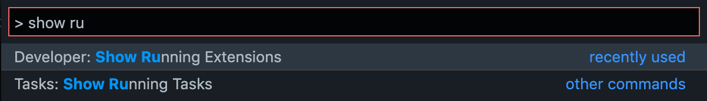
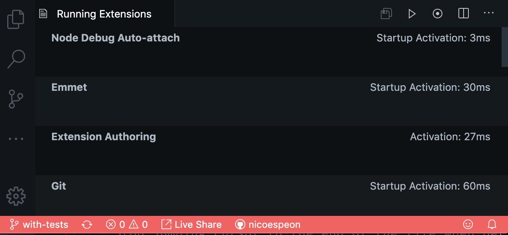
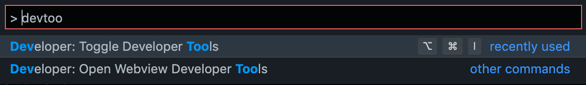
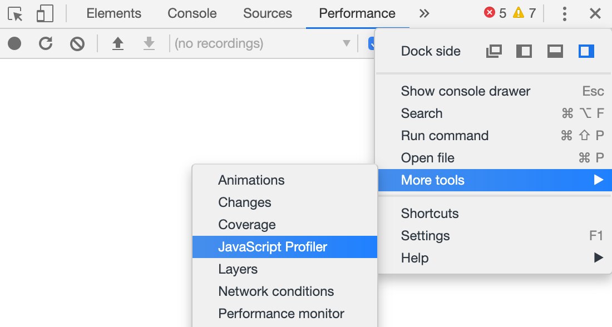
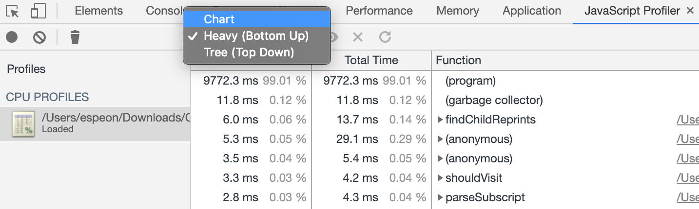
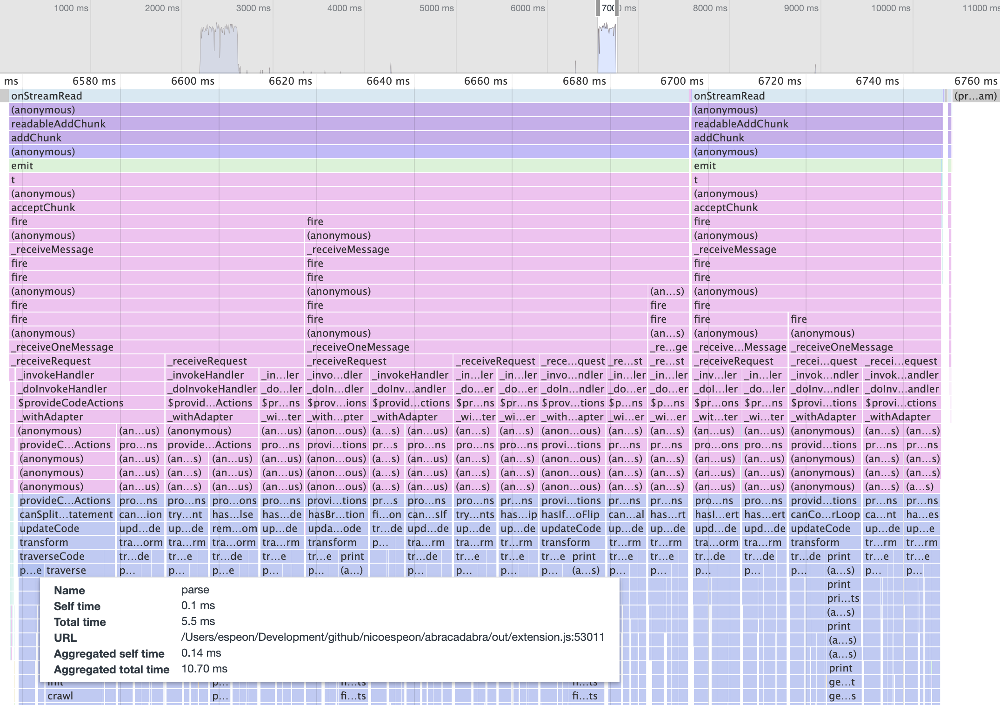
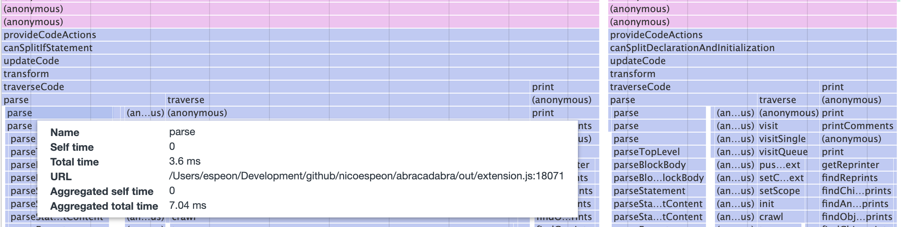
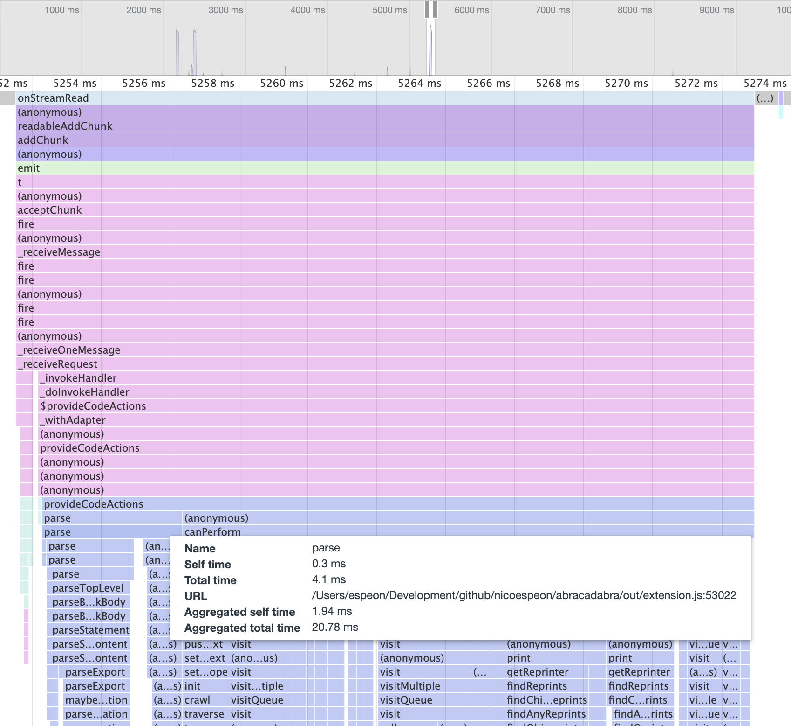

I'm developing a VS Code Extension that provides intuitive automated refactorings in JavaScript and TypeScript. It's called [Abracadabra](https://vscode-abracadabra.com/).

Recently, I looked for performance bottlenecks to make it faster. In this article, I'll explain how I did that, so you can do the same.

## How do you know you need to improve performances?

When I make things, I try to follow the mantra:

> "Make it work, make it right, make it fast."
>
> — Kent Beck

Abracadabra is a side-project. I first developed the features I needed and shipped that. As I learned along the way, I kept refactoring the code to improve readability, thus maintainability. During this process, I took decisions I knew were a bit naive from a performance standpoint, but they simplify a lot the development. A few months after the first release, I had developed more than 20 automated refactorings. Today, it makes me much more productive when I code.

Most refactorings are exposed as VS Code [Quick Fixes](https://code.visualstudio.com/docs/editor/refactoring#_code-actions-quick-fixes-and-refactorings). Regarding where your cursor is, VS Code will tell you the relevant refactorings you can perform through the lightbulb 💡

To determine what are the relevant refactorings, Abracadabra naively tries to perform each of them. Each refactoring that could change the code would be considered relevant. Any time the cursor changes position, VS Code would ask Abracadabra the same question: what are the relevant refactorings on this code, from the current selection? Hence, any time the cursor changes position, Abracadabra recomputes all refactorings of the catalog, again.

That doesn't sound very performant, does it?

Indeed, [I thought about it at the beginning](https://github.com/nicoespeon/abracadabra/issues/18#issue-472611520), 2 weeks after the very first release. However, **it wasn't needed at that time**. At that time, despite the theory, I couldn't feel performance issues from usage. Thus, the naive implementation was fine. It kept the code simple, allowing me to develop more and understand the problem better.

Improving performance implies writing less naive, harder to maintain code to make it fast enough for the users.

Improving performance is a tradeoff on code maintainability.

That's why I think you shouldn't improve performance without measuring it. **Measure performance.** That's how you know if you need to improve it or if it's good enough.

## How to measure the performance of a VS Code Extension?

VS Code provides quite a good tooling to do so.

### Show Running Extensions

The first thing you need to do is to [debug your extension](https://code.visualstudio.com/api/get-started/your-first-extension#debugging-the-extension). You certainly want to measure performance before and after your changes. Debugging your extension opens an extension host that will compile your extension code, so you can run it live.

In the Extension Host, open the Palette (`⌘ ⇧ P` / `Ctrl Shift P`) and search for **Show Running Extensions**.

That will open a tab wich list your running extensions:

The first thing you can see from this tab is the _Startup Activation_ time. It tells you the time each extension took to activate.

As a rule of thumb, if your extension takes more than 500ms to activate, there's probably something you could do to speed that up—it'd be a good idea to [bundle your extension](https://code.visualstudio.com/api/working-with-extensions/bundling-extension) if you don't do that already.

If you're below that, I'd say that's OK. Around 100-200ms is great. Below is amazing 😉👍

Now, that was for startup activation time. But if you're probably concerned with your extension _runtime_ performance. So how can we track that?

### Record Extension profile

On the top right, you have a series of icons that will allow you to record a performance profile of the extension at runtime.

Click on the record button (the dot in the circle). It will turn red, meaning it's recording.

Then, go back to your code. Trigger your extension. In the case of Abracadabra, I was suspecting performance issues on Quick Fixes, so I moved my cursor around the code, to trigger Quick Fixes.

When you're done, go back to the **Running Extension** tab and stop the recording. Then, click on the most-left icon to download the `.cpuprofile` you just recorded.

This CPU profile can be loaded in some DevTools. You can use the DevTools available in VS Code! Open the Palette again, and search for **Toggle Developer Tools**.

If you're familiar with Chrome DevTools, well, it's the same. Open the **JavaScript Profiler** tab. This one is hidden: you need to reach for the 3 dots menu → More tools → JavaScript Profiler.

From there, you can start profiling JS—but we already did that using VS Code Running Extension. You also have a **Load** button you can use to load your `.cpuprofile`.

_Note: on Mac OS, if your finder doesn't show all file extensions, it might save the file as `.cpuprofile.txt` and you won't notice. If you can't it that in DevTools, use the terminal to rename it with the proper extension (remove the `.txt` part)._

### Analyze the profile

I prefer to use the Flame Chart, it's much more visual.

I'll suppose you know [how to interpret Flame Charts](https://developer.mozilla.org/en-US/docs/Tools/Performance/Flame_Chart).

From this specific one, we can see 2 things:

1. The extension `parse()` the code repeatedly, which adds up and takes a lot of time in the end.
2. It runs one `provideCodeActions()` per refactoring, which could also be optimized.

That's even clearer if we zoom in a bit:

So I went back to the code and optimized for that.

I parsed the code only once, then gave the AST to all refactorings. Then, I collected the list of available refactorings and provided them to VS Code only once. Here's the same profiling, after the changes:

Much. Better. 😘👌

### Anecdote: optimizing for performance makes code less intuitive

As you can see, profiling Abracadabra made me confident the problem was essentially due to every individual refactoring reparsing the same code. This was naive and I optimized so the code is now only parsed once.

But when I did so, I created issues that didn't exist before! I had to tackle them.

Indeed, all refactorings now share the reference to the same AST. If one refactoring were to modify that reference, that would cause problems to the others. Cloning the AST could sound like a solution. I actually tried that and measure the performances after. It was worse. In fact, cloning the AST between each refactoring was **more expensive** than parsing the code each time.

That's the heart of performance optimization: don't guess, measure. Sometimes you'll guess right. Sometimes, you won't.

The actual fix was to ensure each refactoring wouldn't mutate the AST when running for Quick Fixes. I had to introduce a bit more complexity in the code to optimize it. That's usually the case when you optimize for performances. That's why I follow Kent Beck's mantra. If the code is simple enough, it's easy to tweak it where necessary, for performance reasons.

Oh and a useful tip: when you do that, leave a comment to explain why this part of the code is not simpler. Your future-self and colleagues will thank you.

## Conclusion

If you're developing a VS Code Extension, I hope this guide would have helped you to find and fix performance issues.

If you have a problem with your VS Code performances in general, I suggest you read [their wiki page on performance issues](https://github.com/microsoft/vscode-wiki/blob/master/Performance-Issues.md),

If you're using VS Code to code in JavaScript or TypeScript, I can only recommend you give a try to [Abracadabra](http://bit.ly/vscode-abracadabra). I craft these automated refactorings so they are useful and quick to use. It should save you a lot of time every day. It does for me 🙂

Finally, I wish I made you think twice about handling performance issues. Make it work, make it right, make it fast. What do you think?
