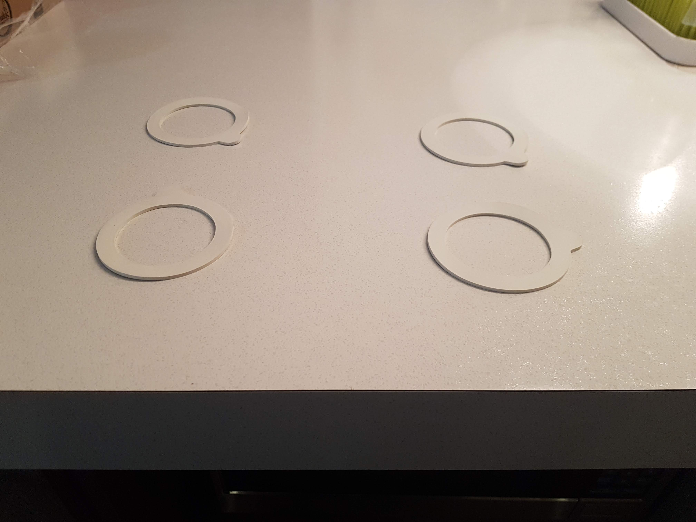
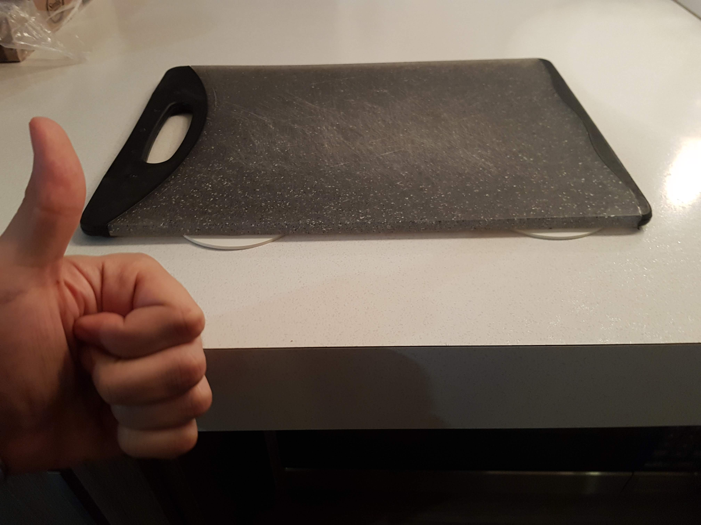

Another cooking trick today 👨‍🍳

Maybe you're like me and you have a very basic, yet efficient cutting board.

If so, you might struggle as well to stabilize it when you cut food. It might even have little rubber feet to prevent it from moving, but it's not always very efficient.

A few months ago, I did a cooking class with my wife at [Ateliers et Saveurs](https://www.ateliersetsaveurs.com/en/), in Montréal. They taught us a very simple trick to make sure the cutting board won't move at all.

**Put 4 jar gaskets under your cutting board.**

It's very efficient. My simple cutting board is stable, so I can chop safely 🔪🥒

If you don't already have some, you can easily find and buy these. They are usually cheap (~3\$ CAD each).

**And you, do you have tips & tricks for cooking?** 😜
