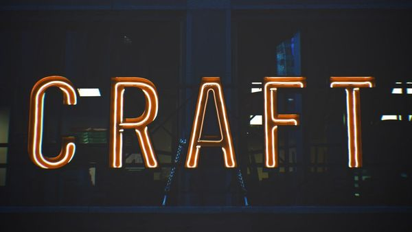
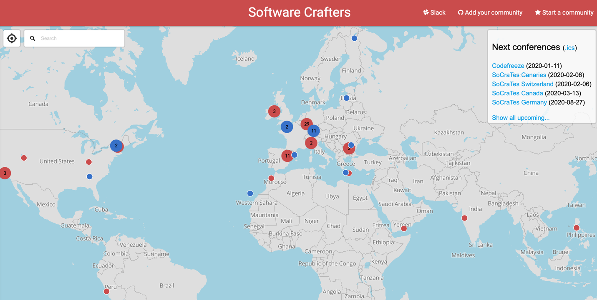
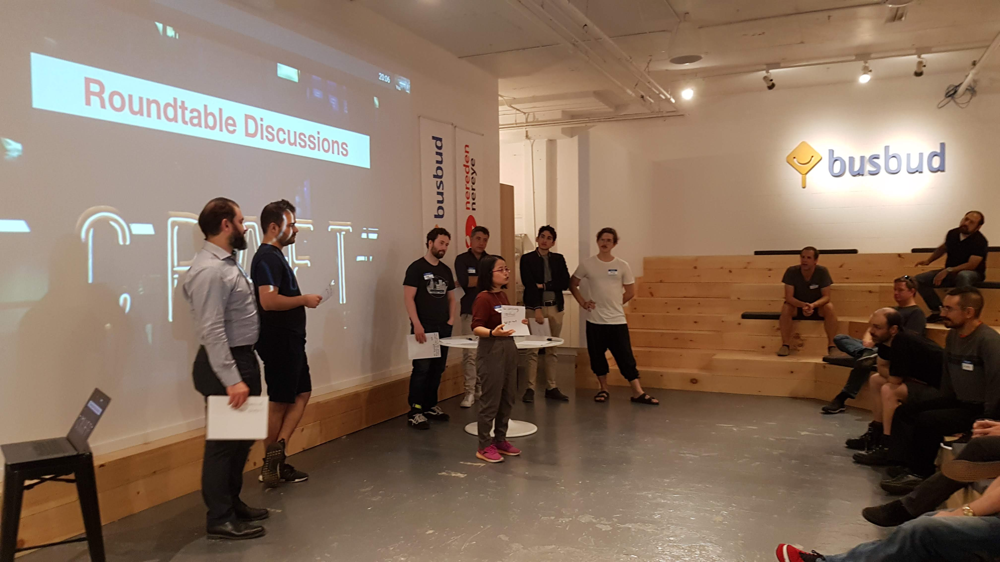
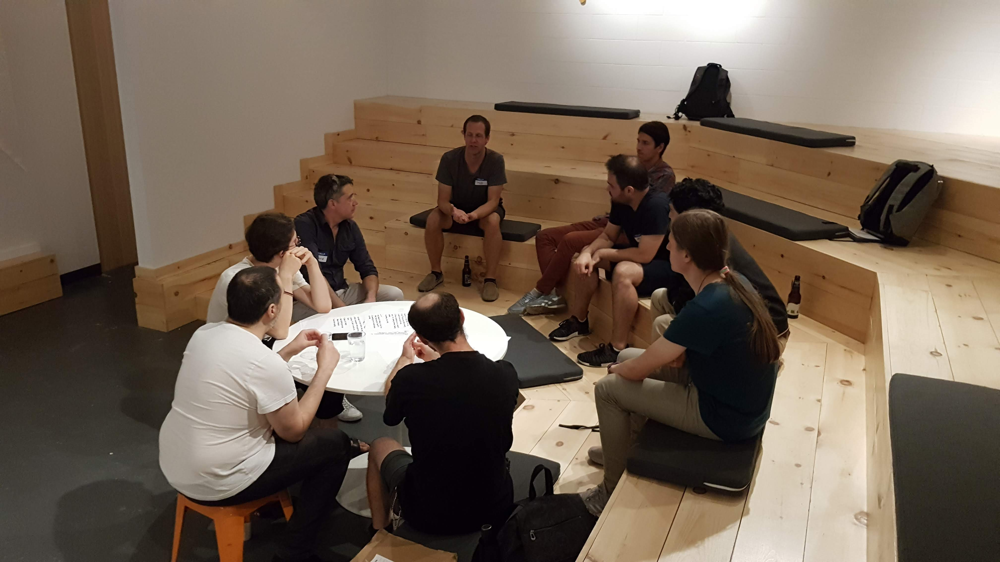
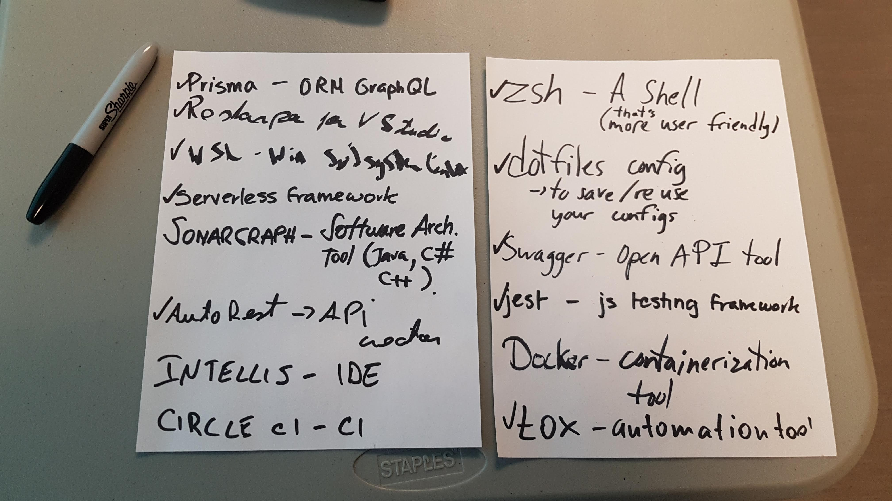
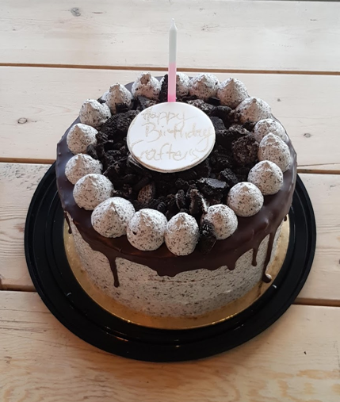

As we're approaching the new year, I'm taking some time to reflect on what happened in 2019. In particular, I would like to share my thoughts regarding the Software Crafters community of Montreal.

## 2018, arriving at Montreal 🛬

That was almost 2 years ago, in February 2018. My wife and I left Paris for a one-way trip to Montreal, Canada. I won't go into the details of this decision (that would worth a dedicated blog post), but I can tell you today that we've found the perfect work-life balance here. We enjoy such a high-quality life that we've started to build our family: our daughter, Alice, was born in September 2019. We're here to stay 👪 🇨🇦

On a personal note, I was really involved in the tech community, back in Paris. Meetups. I did a lot of meetups since 2013. I attended to a lot of them, I talked to some of them and I even got into organizing a few of them: [Backbone.js Paris](https://www.meetup.com/fr-FR/backbone-paris/), [Paris Web Components](https://www.meetup.com/fr-FR/paris-webComponents/) and the [Best of Web](http://bestofweb.paris/) conference I initiated in 2016 with [Cyril Balit](https://twitter.com/cbalit) and other meetup organizers.

When I arrived in Montreal in 2018, I was really looking into joining the tech community.

And certainly more than any other tech meetup, I was looking for some kind of "Software Crafters" community. [The one in Paris](https://www.meetup.com/fr-FR/paris-software-craftsmanship/) is huge and one of the most interesting meetups I've been to. It's not yet another group of people interested in some technology or hyped framework who'd watch amateur talks about that technology or framework every month. The "Software Crafters" community is [a worldwide group](https://www.softwarecrafters.org/) of diverse people who are interested in building high-quality software. Communication and practices matter more than specific tools. We talk about testing, software architecture, how to better understand business problems, how to write maintainable code, how to build great teams, etc.

<figure>
	
	<figcaption>Software Crafters communities, worldwide</figcaption>
</figure>

Ok, you got the point.

But when we arrived in Canada in 2018, there was no "Software Crafters" community in Montréal. At all. To be honest, tech meetups, in general, are less popular here than they are in Paris, even today. I'd say that's cultural. Every day, I'm home before 6pm, sometimes even at 5! In Paris, I was hardly back home before 8pm. That's 2-3 hours I can spend with my family. Hence, that's not surprising it's harder to get people to stay after 7pm to attend a tech meetup compared to Paris!

Still, I knew that a community of Crafters was missing. I mean, there are plenty of developers in Montréal. I bet they also have issues with continuously delivering value to their business without creating bugs in the process. Regardless of the language or company they're working with, they would certainly love to talk with other people about these issues to find better ways.

All it needed was a spark. I thought I could be that spark. I knew what it looked like, and I organized meetups before. So I created [Software Crafters Montréal](https://www.meetup.com/fr-FR/Software-Crafters-Montreal) in September 2018.

## 2019, a growing community 🌱

I remember [the first meetup we had](https://www.meetup.com/fr-FR/Software-Crafters-Montreal/events/251774287/). It was the 4th of September 2019, a Tuesday. 3 people joined. We were 4, sitting around a table. I presented the idea of the meetup.

Indeed, unlike other tech meetups, the "Software Crafters" one has a different format. People don't come to attend a few talks passively. Instead, the meetup adopts [the unconference format](https://en.wikipedia.org/wiki/Unconference): participants drive the content of the meeting.

A typical "Software Crafters" meetup in Montréal looks like that:

1. People arrive progressively, food is available, that's networking time where you meet and talk with other participants

2. All participants regroup, the organizers do a short intro of the meetup for the newcomers and announcements

3. There is a 30min window for lightning talks. These could be 5min talks with slides, but generally, people spontaneously take 2-3 min to share a book, a blog post or a video they really enjoyed.

4. Then, all participants can propose topics for discussions. Typical topics could be "Feature branches vs. Trunk based-development" or "Burn-out: how to prevent and recover" or specific needs like "My coworkers don't want to pair-program, what could I do to make them try?".

   

5. Finally, everyone votes on the proposed topics. The most voted topics got discussed during 1h as we split into groups of ~10 people. Anyone can attend any discussion and move from one group to another if they want to.

   

6. That's it, we regroup for each group to do a summary of what was discussed. Then we say goodbye.

It's a very **social** meetup.

Over 2019, the community progressively grew. For the first 4-5 meetups, we were less than 10 participants, with a no-show rate of ~40%. The "no-show rate" is the percentage of people who registered, but finally didn't show up. For tech meetups, I'd say the average rate in Montréal is 50% since these events are free.

In the 3 last meetups, we were about 25 to attend, with a no-show rate of ~33%.

That makes me really happy. I don't care much about the numbers as long as the quality is here. **I can feel the community is growing**. I met a lot of new people. I saw people coming back. I saw people bringing friends. Every meetup, I connect with new persons and I see familiar faces. And we always have insightful topics. At the last meetup, I was in the group talking about burn-out (preventing it and recovering from it) which triggered powerful feedbacks from people who experienced it. The other group was a roundtable of everyone sharing the tools that saved them a lot of time. A lot of helpful tips and links were shared.

<figure>
	
	<figcaption>List of tools that were shared</figcaption>
</figure>

Retrospectively, in 2019 we did:

- 1 regular meetup every month (so 12 in total)
- 2 special meetups with guests:
  - [J. B. Rainsberger](https://www.meetup.com/fr-FR/Software-Crafters-Montreal/events/261631034/) who improvised an amazing workshop on universal software architecture
  - [Adam Dymitruk](https://www.meetup.com/fr-FR/Software-Crafters-Montreal/events/263866536/) who did a workshop on CQRS and Event Sourcing
- 2 dojos "Introduction to TDD" animated by [Christophe Fernandez](https://www.meetup.com/fr-FR/Software-Crafters-Montreal/events/263779706/)
- We participated in the [Global Day of Coderetreat](https://www.coderetreat.org/), hosting an event in Montréal

All of that was possible thanks to the different hosts and sponsors we had. But most of all, 2 companies really supported us in this initiative:

- [Busbud](https://www.busbud.com/), my employer, which sponsors and hosts the meetup since the very beginning. They give me full support to do what I need to make all of this happens, playing a big part in making this even possible.
- [Zenika](https://www.zenika.ca/), a French consulting company that recently arrived in Canada. Their consultants are really into Craft, so they know what they're talking about. Actually, a lot of Zenika consultants participate in the monthly meetup.

If I ignited the meetup in September 2018, two people rapidly helped me make the flame grow: [Damien Beaufils](https://twitter.com/damienbeaufils) co-organizes the meetups with me since April 2019 and [Khaled Souf](https://twitter.com/khaledsouf) joined us when he arrived in Canada in November—but he started providing support remotely before that, helping me to get in touch with Adam Dymitruk. Not surprisingly, these two great people were part of the Software Crafters Paris community and are Zenika consultants 😉

## 2020, to many more 🍻

End of 2018, I was the one guy organizing a meetup of ~7 persons at Busbud every month.

End of 2019, we're 3 organizers who bring ~25 people every month to different venues in Montréal for regular or special meetups.

I think the community will continue to gently grow in 2020. Maybe we'd be ~50 every month to join and talk.

At least, here's what we've planned for 2020:

- **Our monthly meetup**, as usual, every 1st Wednesday of the month
- **Another monthly event**, oriented on hands-on and practice (think "coding dojo"). We did 2 experimental dojos on TDD in 2019. We'll have that every month in 2020. Thanks to [Badradine Boulahia](https://twitter.com/badraone) who's joining us in the organization, we'll have the bandwidth to make that happens. It's called ["Craft your skills"](https://www.meetup.com/fr-FR/Software-Crafters-Montreal/events/tcpzlrybccbtb/) and it will occur every 3rd Wednesday of the month.
- **The very first [SoCraTes Canada conference](https://socrates-ca.github.io/)**. We'll bring 20 people in a lodge near Mont-Tremblant in March, for 2 days. Craft discussions, coding dojos, snow and fun to be expected 🍁
- **Punctual special meetups** if there is a special guest in town. Who knows.

That's it. 2019 is about to end and I'm really proud to realize how much the Craft community of Montréal is developing.

To many more!

If you want to get in touch, you can join us on Slack, channel **#montreal**: http://slack.softwarecraftsmanship.org/

## My tips and tricks to help you build such a community 📝

I was recently asked if I could provide some advice to people who'd like to build such a community. I think that could be useful to you, so let me share that here.

First of all, if you're willing to build it, thank you. It takes someone to take the initiative. Thanks for being that person ❤️

### It takes courage to create something from the void.

Nothing is in place, you have to set up everything. You'll have to explain something new to people again, and again. Don't give up. Push it through. It's fine to have only 3 people attending.

After a few months, you'll see more and more people attend. Communities are built through time.

### Be consistent.

Make sure people can count on you. Have a clear frequency for the meetup (e.g. 1st Wednesday of the month). That helps to set a pace. It will also push you to find a place and a sponsor.

### Don't do this alone.

Check if your employer can host/sponsor the first meetups. That helps. If not, ask around.

After some time, tell your community you're looking for co-organizers. They will help you carry the load. You want the community to live even when you can't attend because you're enjoying holidays with your family!

### In doubt, ask.

If you don't, then it's already a "no".

If you ask, you increase the odds of getting a "yes".

That's why I pinged JBrains and Adam Dymitruk when I learned they were in town. "Hey, do you think we could set up something with the community and you when you're here?". It's not bold. It's the only way to make good things happen. Surprisingly, they said "yes" and we all had a great time. So go ahead, ask!

### Propose other kinds of food than pizzas-beers.

I mean, these are convenient and quite cheap. But that's not super healthy food. Sometimes, that's just a sloppy organizer fallback.

If you look a bit around, you can find alternatives. Sushis, for example. They are not much more expensive than pizzas because people will eat less of them.

If you have enough time before the event, you can even go to a supermarket to bring some fruits, chips, nuts, snacks, bread, cheese, vegetables… Whatever you want. People like that better and are not used to it.

### Account for the no-show.

I'd recommend keeping track of it, so you can anticipate the food better.

It's fine to do mistakes at first. But you can progressively adjust. After some time, you'll have a good idea of how much sushis to order regarding the number of attendees (for us, it's the number of registered people x 4.5).

### Don't open registrations until 1 week before the event.

To limit the no-show. Otherwise, people register and forget.

It's also a good idea to send a short email the day before to ask people to free their spot if they finally can't attend.

### Celebrate!

For the meetup 1-year anniversary, I bought a little cake (thanks to sponsors) and had a little word. It was a chill moment.

The community we're building is not just another "XYZ Framework" meetup. It's a social group of people who want to have meaningful conversations with others.

These kinds of moments make everyone feel we're part of a human community. I believe that's part of why our no-show rate is lower than other tech meetups out there. And most of all: it feels good.
