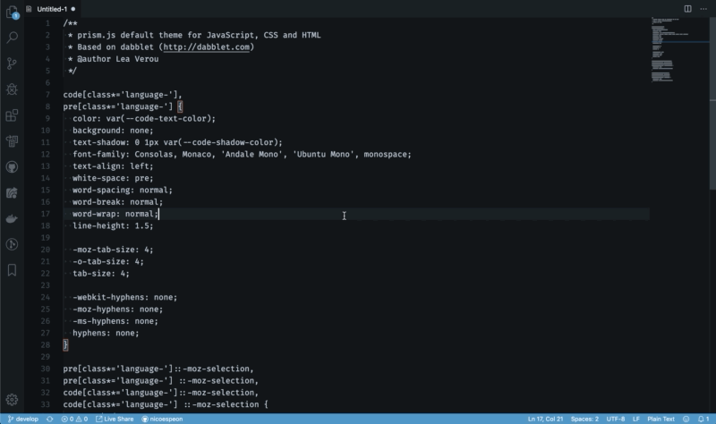
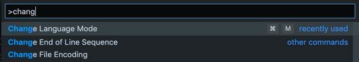

You might be in a situation where you have a text file open in VS Code, but **everything is grey**. You have some code written. Maybe it's CSS, maybe it's JavaScript, maybe it's Python. But you don't have these nice colors that differentiate the variables from the properties, the functions, etc.

Sometimes you end up here because you copy pasted some code from the Internet. Everything looks grey and it seems that VS Code doesn't "understand" your code. 😭

This is a legit question you have to face when you start using this editor.

Hopefully, there is a simple answer. This is not about editor theme or something, it's called the **syntax highlighting**.

If everything is grey, chances are your file is highlighted as a "plain text". So it's just a big lump of text, without any syntax.

To add relevant colors, you need to select the correct "language mode". There are 3 ways to do this.

## Manually change the language mode

At the bottom right of the editor, you'll see "Plain Text" written. Click on this and select the appropriate language from the list.

## With the Command Palette

As for every action in VS Code, you can use the Command Palette. Use the shortcut `Ctrl+Shift+P` and start typing "Change Language Mode".

It will pop up the list where you can select the appropriate language.

## With the shortcut

As you can see in the Command Palette, there's a default shortcut to change the language mode. On Mac OS, it's `⌘ M`.

You can use this shortcut to open the list directly.

Tadaaaa! Now you have meaningful colors again 🎉
