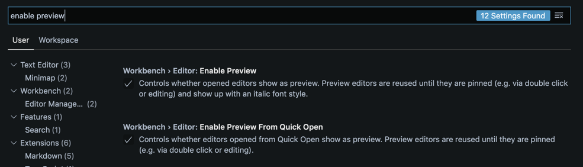
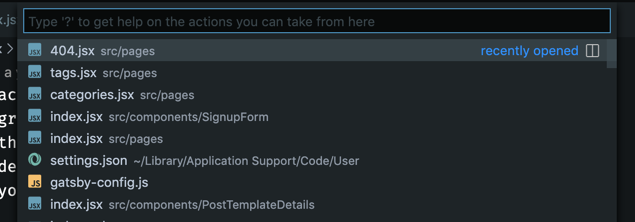

Using Visual Studio Code, you probably noticed this behavior:

1. You click on a file. It opens in a new tab.
2. You click on another file. It opens the file in the same tab, replacing the previous file.


And that can feel a bit annoying. What if you want to open each file in a new tab when you click them? Why is it behaving like that? 😭

Well, if you look closer, you can notice the tab name is _italicised_. In fact, this tab is **a preview** of the file. When you click on a file, you preview its content. Since there can only be one preview tab, the preview will change if you select another file.

Actually, this is a VS Code feature. It's meant to prevent you from opening 10 different tabs if you are just looking for something, but you don't intent to keep the files open. That way, you can easily see what's inside a file, just by clicking on it.

If you want the file to open and stick in it's own tab, you can double-click on the file name, or on the tab.


## OK, but I'd prefer to open files when I click on them. How can I do that?

I hear you. Maybe you usually want to open the files you select and you find that behavior kinda annoying.

It just adds friction because you think the file is open but it's hard to make the difference with a preview. So you forget, you click on another file and snap, your previous file is gone and you need to go get it again!

I've got a good news for you: **you can configure this behavior!** 😉

To do so, open VS Code settings. Search for "enable preview". You'll see a **Workbench › Editor: Enable Preview** option that's certainly checked.



**Uncheck that** to change your editor behavior.

Notice you can also control this behavior for files you open through the **Quick Open** feature.



When you open a file by its name through the **Quick Open** feature, it's probable you want to have it open instead of previewed. If so, uncheck the **Workbench › Editor: Enable Preview From Quick Open** option too.

Finally, if you prefer to update the `settings.json`, here are the keys you're looking for:

```json
{
  "workbench.editor.enablePreview": false,
  "workbench.editor.enablePreviewFromQuickOpen": false
}
```
