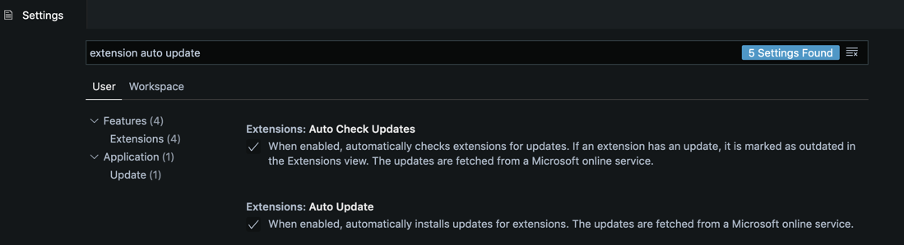

If you use VS Code, you certainly have a couple of extensions installed.

These extensions have a version number that looks like [SemVer](https://semver.org/): vX.Y.Z. How X, Y, and Z evolve is totally up to the extension author. Good extensions usually provide a Changelog to understand the difference between 2 versions.

At this point, a very legitimate question raises up: when a new version is published, how do you know you need to upgrade? Actually, do you need to upgrade extensions yourself? How do you upgrade a VS Code extension anyway?

If you didn't notice already, I've got good news for you: **VS Code automatically checks for extension upgrades**. If it finds a more recent version, it will install it and update your extension the next time you open the editor.

It's good news because that means **you don't have to think about it**, you always get the latest version available. It keeps updating in the background.

Now, maybe that's not the behavior you want. Maybe you've got a limited internet bandwidth and you don't want VS Code to install things under the hood. Or maybe you like to know what's under the hood and you'd prefer check and install extensions updates yourself.

To prevent VS Code extensions from updating automatically, open the editor settings, and search for "extension auto-update":



You should see 2 options checked:

1. **Extensions: Auto Check Updates**
2. **Extensions: Auto Update**

Disable both options. If you still want VS Code to check for updates in the background but install the updates manually, disable the "Auto Update" one.

If you prefer to configure the settings from the JSON file, set the following IDs:

```json
{
  "extensions.autoCheckUpdates": false,
  "extensions.autoUpdate": false
}
```
