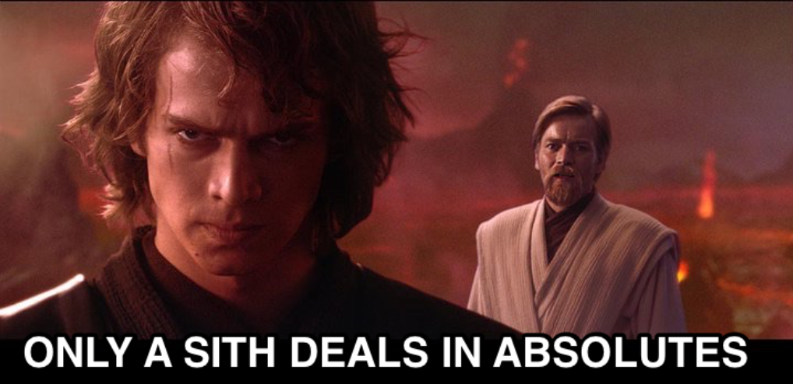

`z.array(SomeSchema)` is the go-to way to validate arrays in Zod. But it has a catch: if _any_ item fails parsing, the whole array is rejected. All valid or nothing.

And that's a scenario that comes up more often than you'd think:

- An inconsistent third-party API sends one oddly-shaped item in a list of 50
- Your backend introduces a breaking change on one field, and suddenly your entire UI is blank

I recently read [The Proper Way to Decode Arrays](https://lucas-barake.github.io/the-proper-way-to-decode-arrays/) by Lucas Barake, which tackles exactly this problem. The solution uses [Effect Schema](https://effect.website/docs/schema/introduction/), and it works!

But I really like to go where my teammates are. Effect has a steep learning curve, and most teams I work with are already using Zod. So I wondered: **can we do the same thing without reaching for another library?**

Turns out, yes. In about 10 lines.

## The helper

```js
import { z } from 'zod'

const DROPPED = Symbol('dropped')

function arrayFromFallible<T extends z.ZodType>(schema: T) {
  return z
    .array(schema.catch(DROPPED as never))
    .transform(items => items.filter(item => item !== DROPPED) as z.output<T>[])
}
```

Instead of `z.array(Todo)`, you write `arrayFromFallible(Todo)`. That's it. `.parse()` returns a type-safe array with the invalid items silently dropped.

```js
const Todo = z.object({
  id: z.number(),
  title: z.string(),
  completed: z.boolean(),
})

const Todos = arrayFromFallible(Todo)

const result = Todos.parse([
  { id: 1, title: 'Buy milk', completed: false },
  { id: 'oops', title: null, completed: 'maybe' },
  { id: 2, title: 'Write blog post', completed: true },
])

// ✅ [{ id: 1, ... }, { id: 2, ... }]
```

The bad item is gone. The good ones are preserved. Your UI isn't blank anymore.

## How it works

The key is `.catch()`. When a Zod schema has `.catch(value)`, it returns `value` instead of throwing on failure. We exploit that in three steps:

1. **`.catch(DROPPED as never)`** wraps the item schema so failed items return a `DROPPED` symbol instead of failing
2. **`z.array(...)`** parses the full array, now containing a mix of valid items and `DROPPED` symbols
3. **`.transform(...)`** filters out the `DROPPED` symbols, keeping only the valid items

Why a `Symbol`? Because it's unique by definition: it can't collide with any actual data in the array. The `as never` cast is a small lie to satisfy TypeScript, but `.transform()` cleans it up immediately.

## When you might want more

This is a fire-and-forget approach: drop the bad items, keep the good ones. If you need to _collect_ the errors (e.g., to report which items failed and why), you can add some logs inside, like the Effect snippet does:

```js
import { Array, Schema, Either, identity, Predicate, ParseResult } from 'effect'

const ArrayFromFallible = <A, I, R>(schema: Schema.Schema<A, I, R>) =>
  Schema.Array(
    Schema.NullOr(schema).annotations({
      decodingFallback: issue => {
        const formattedIssue = ParseResult.TreeFormatter.formatIssueSync(issue)
        console.warn('[ArrayFromFallible]:\n', formattedIssue)
        return Either.right(null)
      },
    })
  ).pipe(
    Schema.transform(Schema.typeSchema(Schema.Array(schema)), {
      decode: Array.filter(Predicate.isNotNull),
      encode: identity,
      strict: true,
    })
  )
```

Effect is a great library. But it doesn't have to be all-or-nothing. Zod can do it fine.


