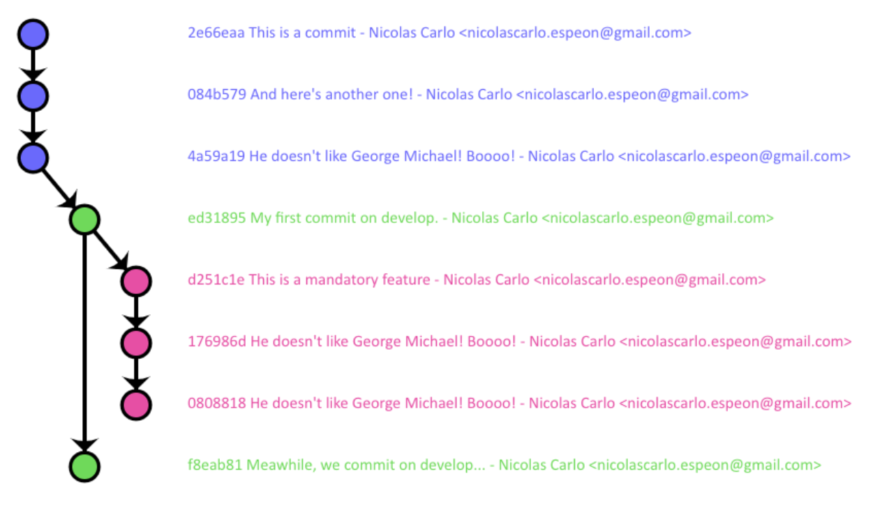
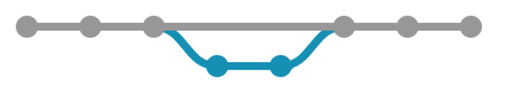

## Le problème

Il y a quelques temps je rédigeais un article sur [les workflows git](/fr/2013/08/quel-git-workflow-pour-mon-projet). Pour illustrer mes propos, je souhaitais m'appuyer sur une représentation visuelle de ces workflows.

Or, si le git-flow propose déjà une illustration sympathique et claire, il n'y a rien de tel pour le GitHub flow par exemple.

Par chance, [@nvie](https://twitter.com/nvie) donne [la source de son illustration](http://github.com/downloads/nvie/gitflow/Git-branching-model-src.key.zip). Par chance aussi, j'ai Keynote. J'ai donc pu créer, à la main, ma seconde illustration, pour ensuite l'exporter afin d'obtenir une image à insérer dans mon article.

Si l'opération n'était pas très complexe, pour peu d'avoir les logiciels adéquats, elle n'en reste pas moins frustrante :

* et si je veux apporter une petite modification à mon illustration ?
* et si je veux changer le style de mon dessin ?
* et si je veux rendre le graphe interactif ?
* et si je veux apprendre le saxophone ?

## La solution

L'idée était donc de trouver une petite bibliothèque JavaScript qui aurait permis de dessiner à la volée des graphes pour illustrer des workflows git (ou équivalents).

N'ayant rien trouvé de convaincant, [@fabien0102](https://twitter.com/fabien0102) et moi avons décidé de la développer : **GitGraph.js** !

Les _guidelines_ sont les suivantes :

* API simple et intuitive
* flexibilité et robustesse du résultat
* rendu customisable à souhait

Le projet est passé à un état standard satisfaisant pour répondre à nos premiers besoins. Nous avons donc sorti la `v1.0.0` (et promis, on suivra scrupuleusement [Semver](http://semver.org/) !).

### Installation

Plusieurs solutions sont à votre disposition :

* soit en téléchargeant [l'une des dernières releases](https://github.com/nicoespeon/gitgraph.js/releases) sur GitHub
* soit en passant par [Bower](http://bower.io) avec `bower install gitgraph.js`

### Mise en place

Le process d'installation est assez simple.

Commencez par ajouter le JavaScript (de préférence avant le `</body>`) :

```html
<script type="text/javascript" src="js/gitgraph.min.js"></script>
```

Puis le CSS (de préférence avant le `</head>`) :

```html
<link rel="stylesheet" type="text/css" href="css/gitgraph.css" />
```

Enfin, préparez un ou plusieurs `<canvas>`, identifiés pour **GitGraph.js** :

```html
<canvas id="my-first-gitgraph"></canvas>
<!-- un peu de HTML ici (…) -->
<canvas id="another-graph-here"></canvas>
```

C'est bon, vous êtes prêts, _yapuka_ dessiner !

### Utilisation - Quelques exemples

L'utilisation de la bibliothèque est assez simple : il suffit de créer un nouveau GitGraph pour un canvas ciblé, puis de dessiner le graphe souhaité.

Un certain nombre de paramètres sont personnalisables à la création, à savoir :

* le template désiré : `"blackarrow"` ou `"metro"` (par défaut)
* l'orientation du graphe : `"vertical-reverse"`, `"horizontal"`, `"horizontal-reverse"` ou bien `"vertical"` (par défaut)
* le mode d'affichage : `"compact"` pour masquer les messages de commit, ou `"extended"` (par défaut, affichage `"vertical"` seulement pour le moment)
* l'ID du canvas ciblé (`"gitGraph"` par défaut)
* l'auteur par défaut pour les commits

On crée donc un nouveau graphe très simplement ainsi :

```javascript
var monGitGraph = new GitGraph({
  elementId: 'mon-canvas',
})
```

Puis on peut créer des branches :

```javascript
var master = monGitGraph.branch('master')
```

Faire quelques commits :

```javascript
monGitGraph
  .commit()
  .commit()
  .commit() // 3 commits sur HEAD
```

Créer une nouvelle branche et committer dessus :

```javascript
var develop = monGitGraph.branch('develop')
develop.commit() // Ce commit sera sur `develop`
```

Et faire ce que l'on veut d'ailleurs :

```javascript
// Une nouvelle branche `feature` depuis `develop`
var myFeature = develop.branch('myFeature')

// Un commit customisé
myFeature.commit({
  dotColor: 'white',
  dotSize: 10,
  dotStrokeWidth: 10,
  sha1: '666',
  message: 'Pimp dat commit',
  author: 'Jacky <prince@dutunning.com>',
})

// Et on ferme la feature dans `develop`
myFeature.merge(develop, 'Epic merge commit')

// Si on ne va plus committer dessus, on peut complètement supprimer la branche
myFeature.delete()
```

L'idée est que la bibliothèque **s'adapte aux usages** afin de rester intuitive.

Il reste encore pas mal de fonctionnalités à implémenter et de petits bugs à corriger. Mais si vous vous en servez, n'hésitez pas à nous faire remonter soucis ou suggestions =)

### Utilisation - Le résultat

Voyons donc quelques exemples d'utilisation basiques que l'on peut mettre en place actuellement avec la bibliothèque.

Ce JavaScript :

```javascript
var blackarrowSolution = new GitGraph({
  elementId: 'blackarrow-solution',
  orientation: 'vertical',
  template: 'blackarrow',
  author: 'Nicolas Carlo <nicolascarlo.espeon@gmail.com>',
})

var master = blackarrowSolution.branch('master')
blackarrowSolution
  .commit('This is a commit')
  .commit("And here's another one!")
  .commit()

var develop = master.branch('develop')
develop.commit('My first commit on develop.')

var feature = develop.branch('feature')
feature
  .commit('This is a mandatory feature')
  .commit()
  .commit()
develop.commit('Meawhile, we commit on develop…')
feature.merge(develop, 'Merged into develop')
feature.delete()

develop.commit('Add some commit here…').commit()
develop.merge(master, 'Here we merge!')
master.commit().commit()
```

Produira le résultat suivant :



Tandis que ce code :

```javascript
var metroSolution = new GitGraph({
  elementId: 'metro-solution',
  orientation: 'horizontal',
})

var master = metroSolution.branch('master')
metroSolution
  .commit()
  .commit()
  .commit()

var develop = master.branch('develop')
develop.commit().commit()

develop.merge(master, 'Here we merge!')
master.commit().commit()
```

Donnera ce graphe :



## Le projet

<span class="icon-github">&nbsp;</span> Le projet est open-source, disponible sur GitHub : <a href="https://github.com/nicoespeon/gitgraph.js">https://github.com/nicoespeon/gitgraph.js</a>

N'hésitez pas à [ajouter une issue](https://github.com/nicoespeon/gitgraph.js/issues/new) pour toute remarque / suggestion / correction à apporter au projet, voir à y contribuer. [La documentation technique du code](http://gitgraphjs.com/docs/) est également disponible. Une documentation plus fonctionnelle est également envisagée, avec le support d'exemples concrets.

Le projet est publié sous license MIT, <a href="http://choosealicense.com/licenses/mit/">simple et permissif</a>.

En attendant, vous pouvez toujours allez jeter un oeil au site pour plus d'informations sur la prise en main de la bibliothèque : <a href="http://gitgraphjs.com">gitgraphjs.com</a>.

## Hey mais et le sax dans tout ça ?

Ma foi il n'y a qu'à demander, sur ce je vous laisse sur un petit air de Georges Michael \o/

<iframe width="560" height="315" src="http://www.youtube.com/embed/GaoLU6zKaws?rel=0" frameborder="0" allowfullscreen="true">&nbsp;</iframe>
