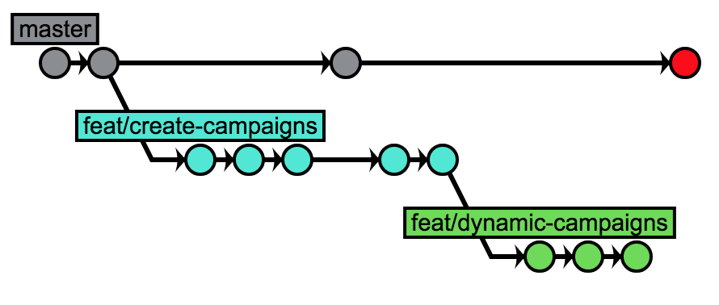
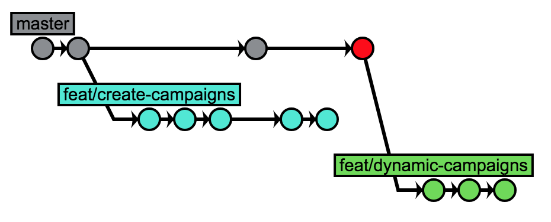
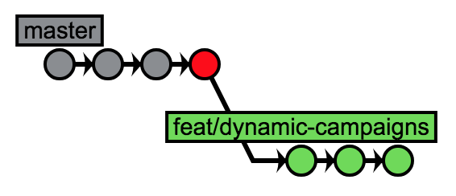

C’est jeudi.

Le Sprint M a commencé lundi, sous les applaudissements rituels qui ponctuent chaque daily standup. Le backlog de cette itération te semblait ambitieux, trop optimiste, plein à craquer. Une nouvelle montagne que l’équipe s’attelait à dépecer méthodiquement, morceau par morceau, pour former progressivement un nouveau tas dans la colonne “Done”. La montagne s’écoule à présent dans chaque colonne du flow. Chaque story affiche la tête de la personne − souvent un développeur − qui travaille actuellement dessus. Le tout forme une chaîne, les stories s’écoulent de gauche à droite, portées par les membres de l’équipe…

> Comme des fourmis qui ramènent des provisions dans la fourmilière.
> Tu voudrais t’attarder sur cette métaphore, mais Ahmed te ramène à la réalité : « Pour la code review que tu m’as demandé : c’est bon si je te fais ça à 15 h ? J’ai pas vraiment de temps avant… »

Tu fronces les sourcils :

« Hmmmm j’veux bien mais ça m’embête un peu. La prochaine feature que je dois attaquer dépend de ces changements alors… Ça me bloque.

− J’comprends, mais je peux vraiment pas le faire avant. Et je voudrais pas faire ça à l’arrache non plus.

− OK, va pour 15 h !

− Et puis t’as qu’à commencer à partir de cette branche. Tu rebaseras après.

− Comment ça ?

− Ben t’as qu’à commencer à partir de cette branche. Tu crées une nouvelle branche à partir de celle-ci, et tu travailles dessus.

− Heuuuuu… Oui, mais non. Si je fais ça, je vais avoir tous les changements des 2 branches dans le diff de la PR. On va s’emmêler les pinceaux !

− Fais-moi confiance. Crée une nouvelle branche, travaille dessus et on verra toute à l’heure comment gérer ça.

− Si tu le dis… Merci. »

Tu te retournes vers ton écran pendant qu’Ahmed se dirige, le pas pressé, vers la salle de réunion, son ordinateur sous le bras. Tu hésites encore un peu.

> Ma foi, tant pis.

<figure>
  
  <figcaption>Création de la branche `feat/dynamic-campaigns`</figcaption>
</figure>

---

15 h 30. Tu reçois la notification qui t’annonce que ta PR a été approuvée. Un sentiment de satisfaction dessine un sourire sur ton visage. Au même moment, Ahmed fait rouler sa chaise jusqu’à ton poste.

« Legit to me. Beau boulot sur la feature, j’ai rien trouvé à redire, c’était limpide !

− C’était une petite PR aussi, ça aide.

− C’est sûr. En tout cas, tu peux merger.

− Yep, j’étais en train de le faire eeeeet… C’est fait !

− Top ! »

Alors qu’il s’apprête à faire rouler sa chaise dans le sens opposé, tu le rattrapes.

« Attends une minute. J’ai créé une branche comme tu m’as dit. J’ai commit dessus, mais maintenant elle part de l’autre branche, celle qui est mergée.

− C’est pas un problème. Faut que tu la rebase sur master.

− Et comment je fais ça s’il te plaît ?

− C’est pas sorcier tu vas voir. Montre-moi ton historique git pour commencer.

− Voilà. »

<figure>
  
  <figcaption>Historique git, `feat/dynamic-campaigns` partant de `feat/create-campaigns`</figcaption>
</figure>

« Bon, tu vois le dernier commit de master ? C’est la branche que tu viens de merger. On applique une stratégie de “squash and merge”, donc ta feature devient un seul commit sur master.

− J’ai jamais trop compris pourquoi on faisait ça d’ailleurs…

− C’est un autre débat. Pour te la faire courte, certains préfèrent le côté unitaire de “1 commit = 1 feature”. En pratique, vu que nos branches sont assez courtes, ça passe. Et master est toujours stable.

− Mouais… M’enfin j’ai lu que c’était mieux de garder l’historique.

− Peut-être. En tout cas, c’est notre convention pour le moment. Si tu veux la challenger, propose le sujet pendant l’atelier tech, demain.

− OK.

− Bref, ce que tu veux faire toi, c’est prendre cette branche feat/dynamic-campaigns en vert, et la déplacer pour la faire partir de master.

− Hmmmmm… Oui c’est ça.

− Et pour ça, il va falloir utiliser `git rebase`. Il y a une option “onto” qui te permets de faire exactement ça.

− Genre “rebase onto master” ?

− Un truc comme ça oui, regarde. »

<figure>
  
  <figcaption>Rebase de la branche depuis l’ancien parent sur master
</figcaption>
</figure>

Perplexe, tu essaies de comprendre ce qu’il vient de se passer :

« Attends une minute, tu peux m’expliquer ?

− Bien sûr. La commande `git rebase` peut prendre un paramètre “onto” quand tu veux faire des choses un peu moins classiques. Et “onto” accepte 3 arguments.

− Le premier c’est `master`. C’est la branche d’arrivée ?

− Exact ! C’est la référence du nouveau parent de la branche que tu rebase. Ensuite, tu précises la référence de l’ancien parent de la branche en question : feat/create-campaigns dans ton cas.

− Mais, on ne l’avait pas merge celle-là ?

− Sur origin oui. En local, non. Rappelles-toi de ton historique git, tu as toujours cette branche-là sur ta machine.

− OK je vois. Donc nouveau parent, puis ancien parent…

− Et enfin, la référence de la branche que tu veux rebase. En pratique d’ailleurs, n’importe quelle référence de commit fonctionne. Mais généralement, on manipule les branches.

− C’est plus pratique.

− Ouais. D’ailleurs, le dernier argument est optionnel. Si tu ne le donnes pas, il prendra `HEAD` comme référence. Mais bon, je préfère être explicite, ça fait moins de surprises. »

Tu acquiesces tout en affichant à nouveau l’historique git pour visualiser le résultat :

<figure>
  
  <figcaption>Historique git après rebase de la branche</figcaption>
</figure>

« Hé, ça a marché ! C’est comme si la branche était partie de `master` !

− C’était le but.

− Merci beaucoup ! Je vais noter l’astuce dans un coin.

− Tout le plaisir était pour moi ! »

Concluant sur cette tirade, Ahmed s’élance à nouveau pour tenter de rejoindre son bureau d’un seul coup. Raté. Pendant qu’il piétine pour rouler le dernier mètre qui le sépare de son poste, tu finis de nettoyer ta branche locale qui n’a plus vraiment de raison d’être.

> Adieu.

<figure>
  
  <figcaption>Suppression de la branche `feat/create-campaigns`</figcaption>
</figure>

Le sourire aux lèvres, tu jettes un coup d’œil à l’historique git.

<figure>
  
  <figcaption>Historique git final</figcaption>
</figure>

C’est propre.

Tu regardes ta montre. 15 h 45. Tu ouvres à nouveau ton éditeur en te disant que tu as encore le temps d’avancer un peu.

> Une story traitée de plus. Comme les fourmis…
