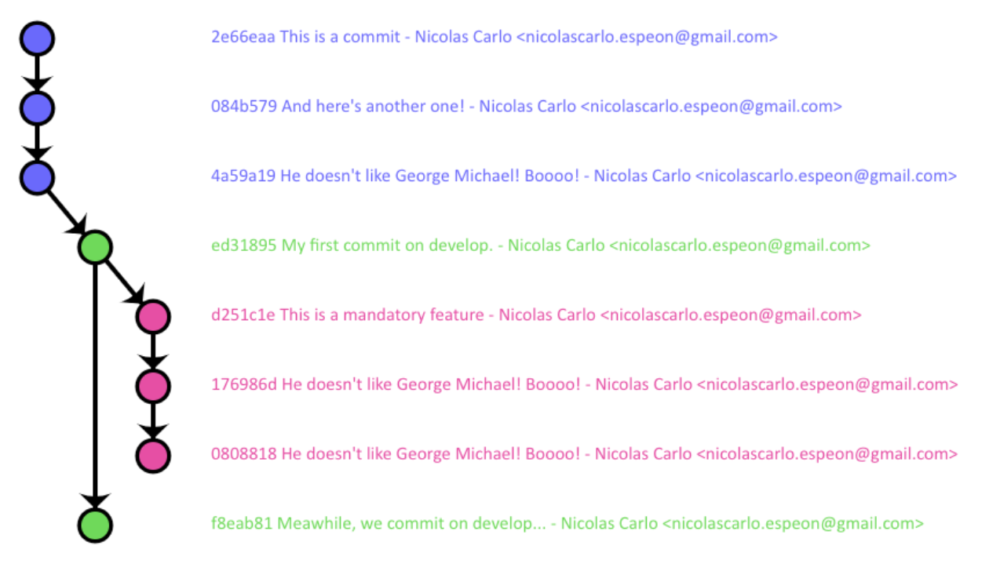
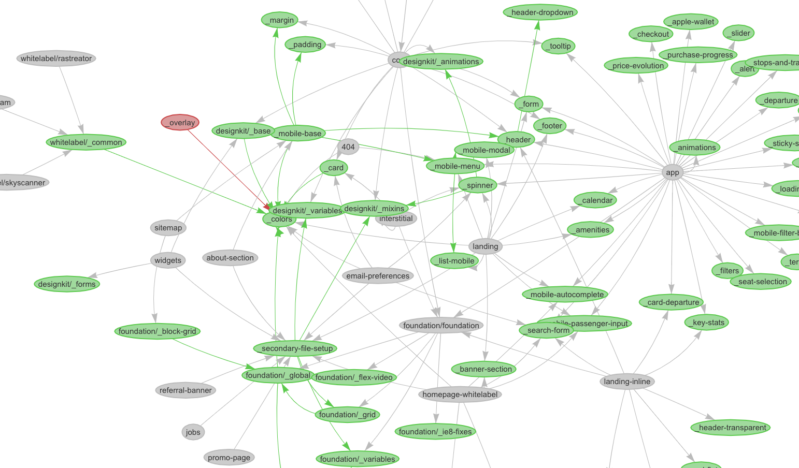
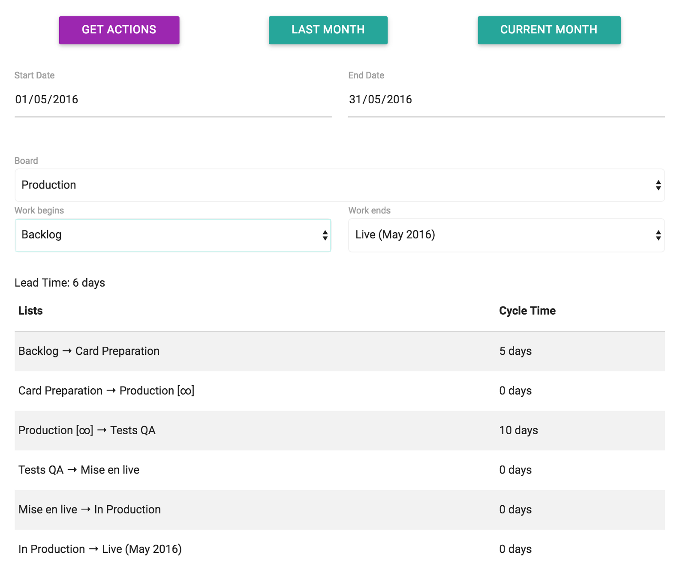
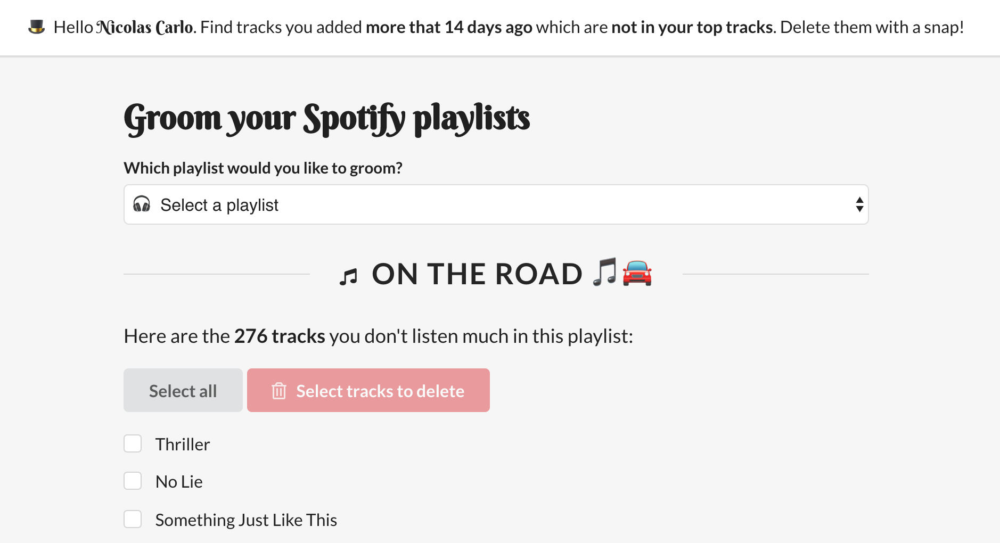

<!-- I don't know why, but this comment makes images path resolution work. -->

All my open-source contributions are [on my  GitHub](https://github.com/nicoespeon/).

## Gitgraph.js

A JavaScript library to draw pretty git graphs in the browser.

[ Check the project](https://github.com/nicoespeon/gitgraph.js)

[I wrote a post on that](/en/2013/11/gitgraphjs/).

## sass-graph-viz

Draw a visual graph of Sass dependencies.

[ Check the project](https://github.com/nicoespeon/sass-graph-viz)

[I wrote a post on that](/en/2018/12/tool-work-with-complicated-sass-codebases/).

## Trello Kanban Analysis Tool (TKAT)

Analyse Kanban metrics from a Trello board.

[ Check the project](https://github.com/nicoespeon/trello-kanban-analysis-tool)

## My Spotify Groomer

Clean my Spotify playlists from tracks I don't like anymore.

[ Check the project](https://github.com/nicoespeon/my-spotify-groomer)

## jest-extended-snapshot

Additional Jest matchers for snapshot testing.

[ Check the project](https://github.com/nicoespeon/jest-extended-snapshot)
