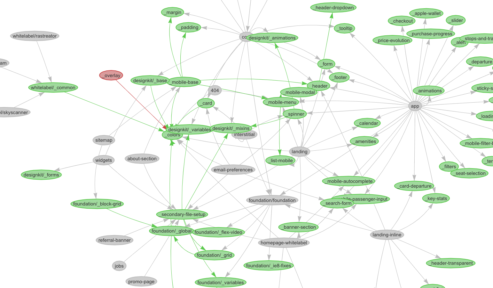
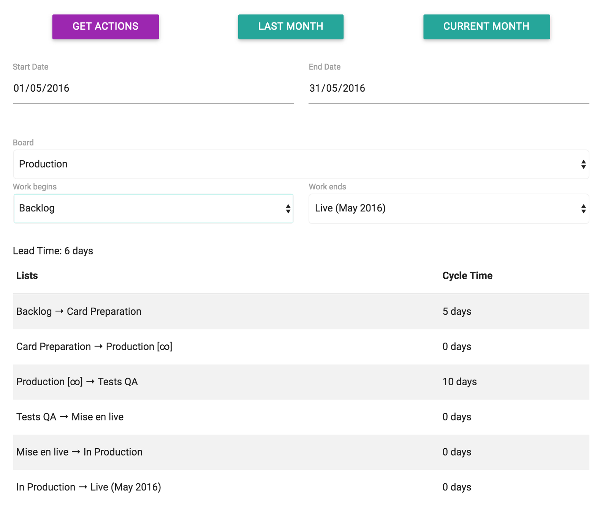
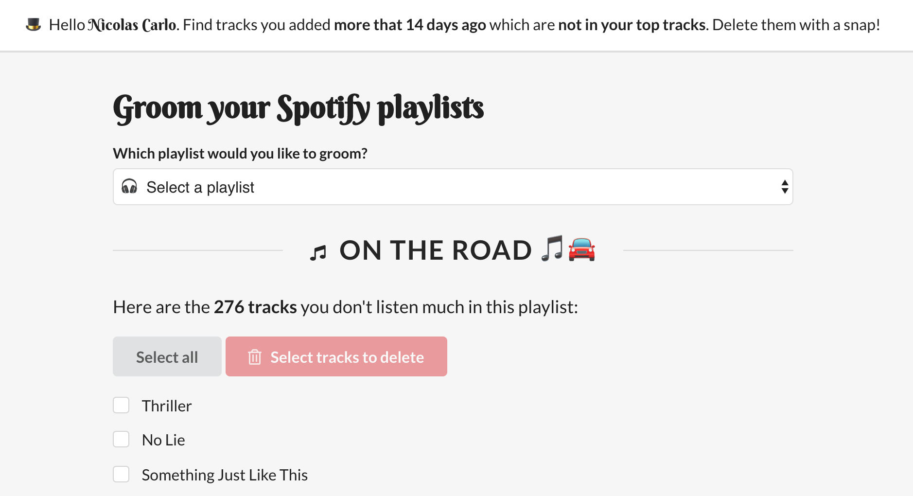

Toutes mes contributions open-source sont [sur mon  GitHub](https://github.com/nicoespeon/).

## Gitgraph.js

Une bibliothèque JavaScript pour dessiner des graphs git dans le navigateur.

[ Voir le projet](https://github.com/nicoespeon/gitgraph.js)

[J’ai écrit un article à ce sujet](/fr/2013/11/gitgraphjs/).

## sass-graph-viz

Génère un graph visuel des dépendances Sass.

[ Voir le projet](https://github.com/nicoespeon/sass-graph-viz)

[J’ai écrit un article à ce sujet](/en/2018/12/tool-work-with-complicated-sass-codebases/) en anglais.

## Trello Kanban Analysis Tool (TKAT)

Analyse les métriques Kanban d’une board Trello.

[ Voir le projet](https://github.com/nicoespeon/trello-kanban-analysis-tool)

[J’ai parlé à ce sujet](/fr/2016/07/trello-kanban-cyclejs/).

## My Spotify Groomer

Nettoie mes playlists Spotify des chansons que je n’écoute plus.

[ Voir le projet](https://github.com/nicoespeon/my-spotify-groomer)

## jest-extended-snapshot

Matchers Jest supplémentaires pour le snapshot testing.

[ Voir le projet](https://github.com/nicoespeon/jest-extended-snapshot)
